# Lesson 1. Типы данных

- [Lesson 1. Типы данных](#lesson-1-типы-данных)
    - [Типы данных](#типы-данных)
        - [Примитивные типы данных](#примитивные-типы-данных)
        - [Составные типы данных](#составные-типы-данных)
        - [Zero-value](#zero-value)
        - [Сегментация типов данных](#сегментация-типов-данных)
        - [Измерение](#измерение)
            - [Размеры типов данных](#размеры-типов-данных)
            - [Адресация](#адресация)
        - [Выравнивание данных (data alignment)](#выравнивание-данных-data-alignment)
        - [Таблица выравнивания и примеры](#таблица-выравнивания-и-примеры)
    - [Целочисленные типы данных](#целочисленные-типы-данных)
        - [Рязряды битов](#рязряды-битов)
        - [Целочисленные литералы](#целочисленные-литералы)
    - [Указатели](#указатели)
        - [Зачем нужны указатели?](#зачем-нужны-указатели)
        - [unsafe.Pointer](#unsafepointer)
        - [uintptr](#uintptr)
        - [Работа с unsafe](#работа-с-unsafe)
    - [Порядок следования байт](#порядок-следования-байт)
        - [Endianness](#endianness)
        - [Зачем придумали разные порядки следования байт?](#зачем-придумали-разные-порядки-следования-байт)
    - [Битовые операции](#битовые-операции)
        - [Битовое И (AND, x \& y)](#битовое-и-and-x--y)
        - [Битовое ИЛИ (OR, x | y)](#битовое-или-or-x--y)
        - [Исключающее ИЛИ (XOR, x ^ y)](#исключающее-или-xor-x--y)
        - [Битовое НЕ (NOT, ^x)](#битовое-не-not-x)
    - [Битовый сдвиг влево (\<\<)](#битовый-сдвиг-влево-)
        - [Битовый сдвиг вправо (\>\>)](#битовый-сдвиг-вправо-)
        - [Gothas битовых сдвигов чисел со знаком](#gothas-битовых-сдвигов-чисел-со-знаком)
    - [Битовые операции на практике](#битовые-операции-на-практике)
        - [Как узнать, является ли число степенью двойки?](#как-узнать-является-ли-число-степенью-двойки)
        - [Битовые маски](#битовые-маски)
            - [Как найти число, которое встречается во множестве только один раз, когда все остальные числа встречаются два раза?](#как-найти-число-которое-встречается-во-множестве-только-один-раз-когда-все-остальные-числа-встречаются-два-раза)
            - [Как проверить, есть ли дубликаты во множестве чисел от 1 до 7?](#как-проверить-есть-ли-дубликаты-во-множестве-чисел-от-1-до-7)
        - [Битовые карты (битовый вектор)](#битовые-карты-битовый-вектор)
            - [Как проверить четность числа?](#как-проверить-четность-числа)
            - [Как конвертировать байты, килобайты, мегабайты?](#как-конвертировать-байты-килобайты-мегабайты)
        - [Хранение и передача IPv4 адресов](#хранение-и-передача-ipv4-адресов)
        - [Выносить операции с битами в функции](#выносить-операции-с-битами-в-функции)

## Типы данных

### Примитивные типы данных

1. Логические: `bool`
2. Строковые: `string`
3. Числовые:

    - целые: `int`, `uint`, `uintptr`, `int8`, `uint8` (aka `byte`), `int16`, `uint16`, `int32` (aka `rune`), `uint32`, `int64`, `uint64`
    - с плавающей точкой: `float32`, `float64`
    - комплексные: `complex64`, `complex128`

### Составные типы данных

1. Указатели
2. Структуры
3. Функции
4. Контейнеры:
    1. массивы
    2. срезы
    3. словари
5. Каналы
6. Интерфейсы

### Zero-value

Каждый тип имеет нулевое значение (`zero value`). По сути это является значением по умолчанию.

### Сегментация типов данных

Можно разделить типы данных так:

1. Basic types: numbers, strings, boolean
2. Aggregate types: array, structs
3. Reference types: slice, map, function, channel
4. Interfaces

Либо так:

1. Types whose values each is only hosted on **one single memory block**:
    1. boolean
    2. numbers
    3. pointer
    4. unsafe pointer
    5. struct
    6. array
2. Types whose values each may be hosted on multiple memory blocks:
    1. slice
    2. map
    3. channel
    4. function
    5. interface
    6. string

### Измерение

- `Бит` - минимальная единица измерения информации, которая принимает значение "ноль" или "один"
- `Байт` (октет) - еденица измерения информации, которая состоит из 8 бит или 2 тетрад
- `Машинное слово` - основная единица информации, которой оперирует процессор (размер машинного слова равен архитектуре процессора, например 32 или 64 битная архитектура)

#### Размеры типов данных

- `bool`, `uint8`, `int8`: 1 byte
- `uint16`, `int16`: 2 bytes
- `uint32`, `int32`, `float32`: 4 bytes
- `uint64`, `int64`, `float64`, `complex64`: 8 bytes
- `complex128`: 16 bytes
- `uint`, `int`, `uintptr`: 4 bytes on 32-bit arch / 8 bytes on 64-bit arch

#### Адресация

В большинстве случаев `RAM` имеет `байтовую адресацию` (то есть ссылается на конкретный байт в памяти), но существуют редкие архитектуры, в которых используется `словесная адресация` (ссылается на адрес машинного слова).

### Выравнивание данных (data alignment)

**Выравнивание данных** (`data alignment`) – это способ размещения данных в оперативной памяти по правилам, способствующим ускорению доступа к ним.

Данные считаются "**естественным образом выровненными**", если их адрес в памяти кратен их размеру. Например, 8-байтовое число с плавающей запятой естественно выровнено, если его адрес кратен 8 байтам.

При сохранении объектов в памяти, некоторые поля, состоящие из нескольких байтов, могут пересекать "естественную границу" машинных слов. Процессоры могут обращаться к невыровненным данным, но делают это менее эффективно, чем к данным, находящимся внутри целого машинного слова. Доступ к невыровненным данным может занимать больше времени.

Чем лучше выравнены данные в памяти, тем меньше чтений из памяти нужно будет процессору.

На изображении виден компромисс. Мы либо:

1. **платим местом и получаем скорость** (есть пустые значения empty из-за выравнивания)
2. храним данные **максимально компактно**, но процессору придется **выполнять больше операций чтения** из памяти

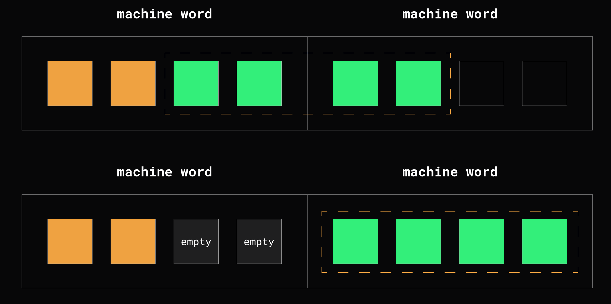

### Таблица выравнивания и примеры

type: alignment guarantee

- `bool`, `uint8`, `int8`: 1 byte
- `uint16`, `int16`: 2 bytes
- `uint32`, `int32`, `float32`: 4 bytes
- `arrays`: depend on element types
- `structs`: depend on field types
- `other types`: size of native machine word

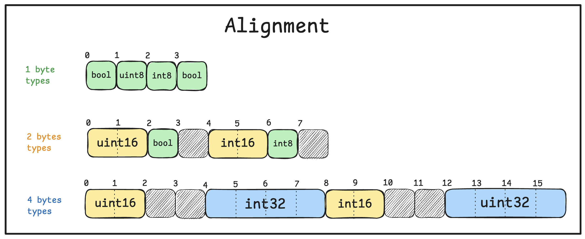

## Целочисленные типы данных

### Рязряды битов

- `LSB` (`Least Significant Bit`) - младший значащий бит (самый правый)
- `MSB` (`Most Significant Bit`) - старший значащий бит (самый левый)

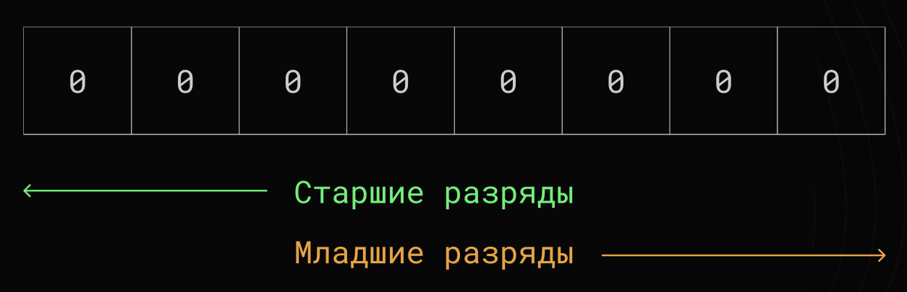

### Целочисленные литералы

- **Двоичные**: префикс `0b` или `0B` (`0b100` или `0B100`)
- **Восьмеричные**: префикс `0` или `0o` (`010` или `0o10`)
- **Шестнадцатеричные**: префикс `0x` или `0X` (`0xF` или `0XF`)
- **Мнимые**: суффикс `i` (`3i`)

Так же, для удобства чтения больших чисел можно использовать `_` в качестве разделителя классов числа, например: `1_000_000_000` (1 млрд.)

## Указатели

`Указатель` - переменная, диапазон значений которой состоит из адресов ячеек памяти или специального значения - нулевого адреса (`nil`).

А теперь простыми словами. `Указатель` - адрес в памяти, если адрес невалидный или его нет, то `nil`.

**Получить адрес**:

```go
// 1 way
pointer := new(int)

// 2 way
var value int
pointer := &value

// 3 way - only for structs
pointer := &SomeStruct{}
```

### Зачем нужны указатели?

1. Передавать адрес переменной в функцию, чтобы изменить значение. В Go по умолчанию копируется значение переменной. А значит, чтобы изменить данные, нам нужно передать указатель. Но если тип данных сам по себе является указателем (например, `slice`), то его можно передавать просто так.
2. Чтобы не копировать структуру, которая имеет много полей и будет весить больше, чем указатель (равен машинному слову).

### unsafe.Pointer

`unsafe.Pointer` represents a pointer to an arbitrary (произвольный) type. There are four special operations available for type `unsafe.Pointer` that are not available for other types:

1. a pointer value of any type can be converted to a `unsafe.Pointer`
2. a `unsafe.Pointer` can be converted to a pointer value of any type
3. a `uintptr` can be converted to a `unsafe.Pointer`
4. a `unsafe.Pointer` can be converted to a `uintptr`

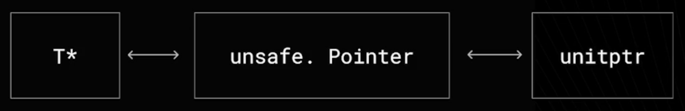

### uintptr

`uintptr` - this is an unsigned integer type which is large enough to hold any pointer address. Therefore its size is platform dependent (32-bit / 64-bit arch). It is just an integer representation of an address.

### Работа с unsafe

```go
// получить unsafe.Pointer для любого указателя
unsafePtr := unsafe.Pointer(&any)

// Получить новый unsafe.Pointer смещенный на 2
// Арифметика указателей
newUnsafePtr := unsafe.Add(unsafePtr, 2)

// Получить размер любого типа данных
size := unsafe.Sizeof(anyType)
```

Арифметику указателей лучше проводить через `unsafe.Add(<unsafe.Pointer>, <len>)`, чем через uintptr: `unsafe.Pointer(uintptr(<pointer>) + uintptr(<pointer>))`.

## Порядок следования байт

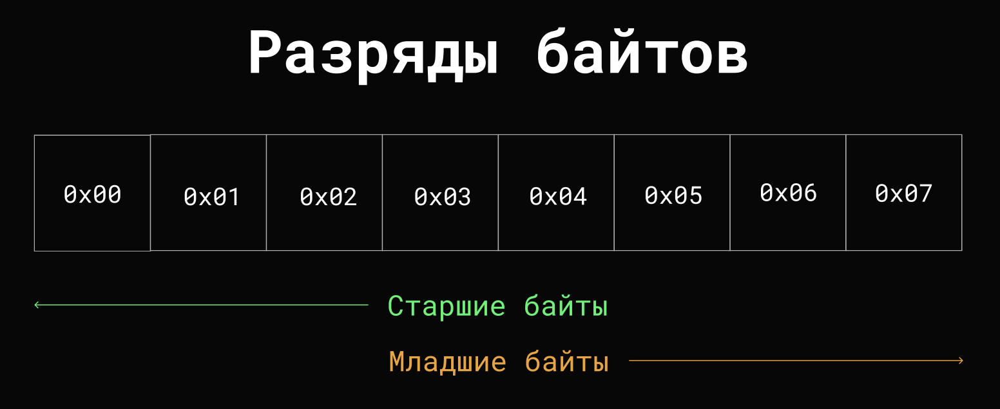

### Endianness

1. `Big Endian` - порядок от старшего к младшему байту. Подобен привычному порядку записи слева направо. Этот порядок является стандартом для протоколов TCP/IP - используется в загаловках пакетов данных и во многих протоколах более высокого уровня, поэтому `big endian` часто называют `"сетевым порядком байтов"`.
2. `Little Endian` - порядок от младшего к старшему байту. Этот порядок принят в памяти персональных компьютеров с процессорами архитектуры x86, в связи с чем иногда его называют `"интеловским порядком байтов"`.

**WARNING!**

**Порядок следования меняется только для БАЙТ, но порядок БИТ остается прежним.**

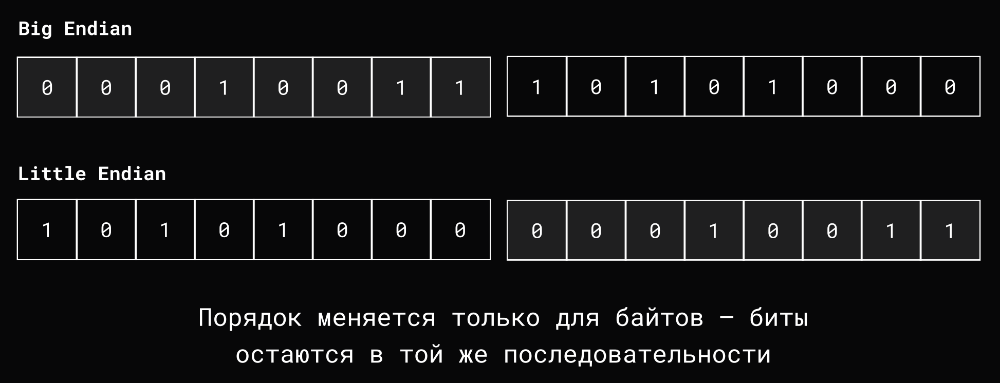

### Зачем придумали разные порядки следования байт?

Each byte-order system has its advantages. Little-endian machines let you read the lowest-byte first, without reading the others. You can check whether a number is odd or even (last bit is 0) very easily, which is cool if you're into that kind of thing. Big-endian systems store data in memory the same way we humans think about data (left-to-right), which makes low-level debugging easier.

Source: <https://betterexplained.com/articles/understanding-big-and-little-endian-byte-order/>

## Битовые операции

Подробнее: <https://tproger.ru/translations/bitwise-operations>

### Битовое И (AND, x & y)

```go
var x int8 = 3     // 0011
var y int8 = 5     // 0101
var result = x & y // 0001
```

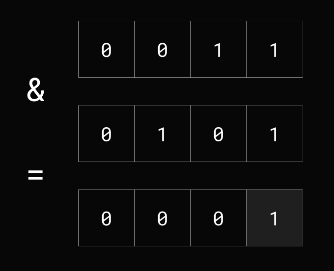

### Битовое ИЛИ (OR, x | y)

```go
var x int8 = 3     // 0011
var y int8 = 5     // 0101
var result = x | y // 0111
```

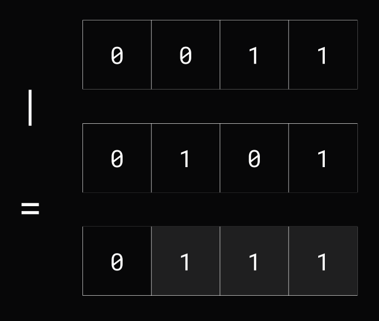

### Исключающее ИЛИ (XOR, x ^ y)

```go
var x int8 = 3     // 0011
var y int8 = 5     // 0101
var result = x ^ y // 0110
```

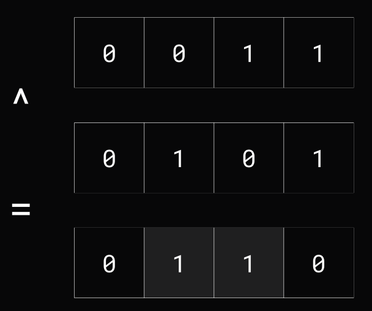

### Битовое НЕ (NOT, ^x)

```go
var x int8 = 3  // 0011
var result = ^x // 1100
```


## Битовый сдвиг влево (<<)

```go
var a uint8 = 0b00000001
fmt.Printf("0b%08b\n", a << 3) // 0b00001000
var b uint8 = 0b11111111
fmt.Printf("0b%08b\n", b << 4) // 0b11110000
```

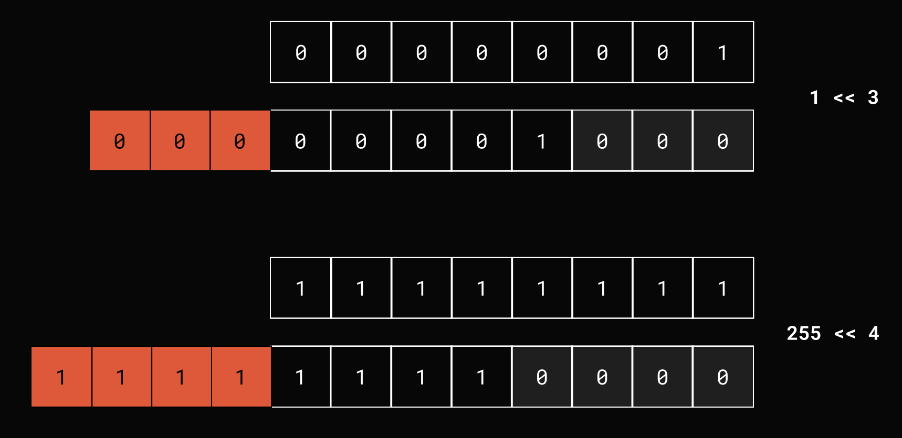

### Битовый сдвиг вправо (>>)

```go
var a uint8 = 0b00010000
fmt.Printf("0b%08b\n", a >> 3) // 0b00000010
var b uint8 = 0b11111111
fmt.Printf("0b%08b\n", b >> 4) // 0b00001111
```

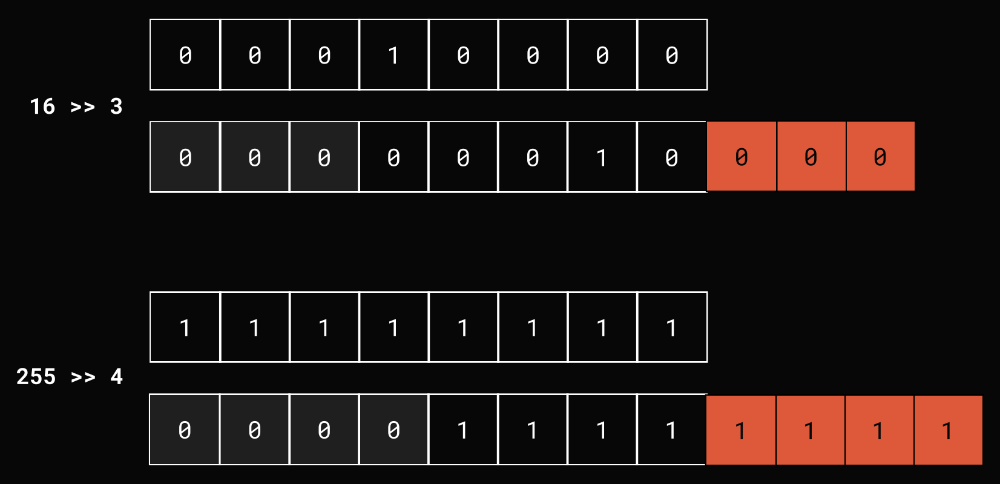

### Gothas битовых сдвигов чисел со знаком

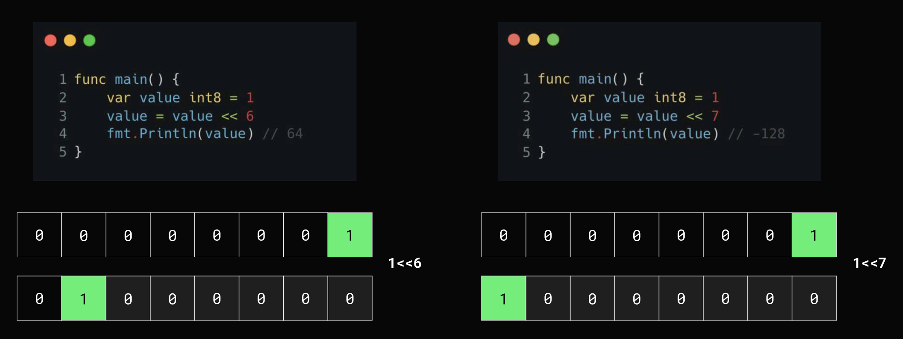

## Битовые операции на практике

Подробнее: <https://tproger.ru/articles/awesome-bits>

### Как узнать, является ли число степенью двойки?

Brutforce - цикл, но можно элегантнее.

Число степени двойки в бинарном представлении имеет только 1 единицу.

[Решение](examples/power_of_two/main.go)

```go
func IsPowerOfTwo(value int) bool {
    return value > 0 && value&(value-1) == 0
}
```

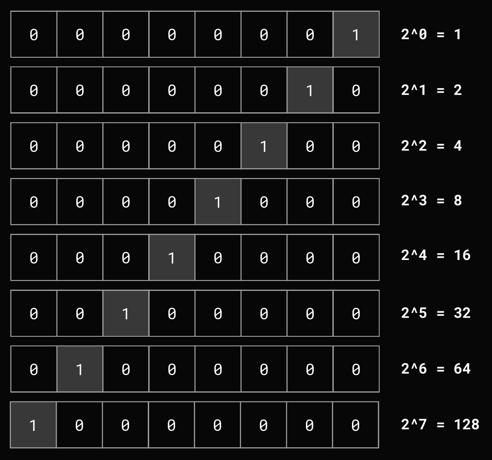

### Битовые маски

[Пример битовой маски](examples/bit_mask/main.go)

```go
const (
    OpenModeIn     = 1 // 0000 0001
    OpenModeOut    = 2 // 0000 0010
    OpenModeAppend = 4 // 0000 0100
    OpenModeBinary = 8 // 0000 1000
    
    // sugar for prepared masks
    OpenModeInAndOut = OpenModeIn | OpenModeOut // 0000 0001 + 0000 0010 = 0000 0011
)

func Open(filename string, mask int8) {
    if mask&OpenModeIn != 0 {
        fmt.Println("in mode")
    }
    if mask&OpenModeOut != 0 {
        fmt.Println("out mode")
    }
    if mask&OpenModeAppend != 0 {
        fmt.Println("append mode")
    }
    if mask&OpenModeBinary != 0 {
        fmt.Println("binary mode")
    }   
    // implementation...
}

func main() {
    Open("data.bin", OpenModeIn|OpenModeBinary) // 0000 1001
    Open("data.bin", OpenModeIn|OpenModeOut)    // 0000 0011
    Open("data.bin", OpenModeAppend)            // 0000 0100
}
```

#### Как найти число, которое встречается во множестве только один раз, когда все остальные числа встречаются два раза?

[Решение](examples/find_unique/main.go)

```go
func main() {
    var array = [...]int8{2, 3, 4, 2, 3, 1, 4}
    
    var number int8
    for _, element := range array {
        fmt.Printf("%08b ^ %08b = %08b\n", number, element, number^element)
        number ^= element
    }
    
    fmt.Printf("\nResult: %08b\n", number)
}
```

#### Как проверить, есть ли дубликаты во множестве чисел от 1 до 7?

[Решение](examples/duplicate_check/check_test.go)

```go
func HasDuplicatesFrom1To7WithBits(data []int) bool {
    var lookup int8
    // 1) lookup = 0000 0000
    // 2) number = 3
    //      2.1) if 0000 0000 & (1<<3) = 0000 0000 & 0000 1000 = 0000 0000 == 0
    //      2.2) lookup = 0000 0000 | 0000 1000 = 0000 1000
    // 3) number = 6
    //      3.1) if 0000 1000 & (1<<6) = 0000 1000 & 0010 0000 = 0000 0000 == 0
    //      3.2) lookup = 0000 1000 | 0010 0000 = 0010 1000
    // 4) number = 3
    //      4.1) if 0010 1000 & (1<<3) = 0010 1000 & 0000 1000 = 0000 1000 != 0
    //          4.1.1) return true (duplicate was found)
    for _, number := range data {
        if lookup&(1<<number) != 0 {
            return true
        }

        lookup |= 1 << number
    }

    return false
}
```

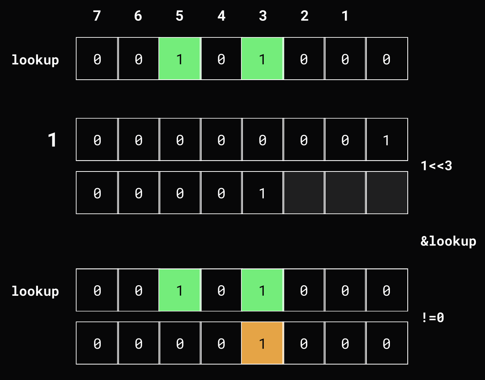

### Битовые карты (битовый вектор)

`Битовая карта` (`bitset`, `bitmap`, `bit array`, `bit vector`) - набор последовательно записанных двоичных разрядов, то есть последовательность битов.

[Пример с поиском ресторана](examples/bitmap_index/main.go)

```go
// 0000 0001 -> есть кальяны
// 0000 0010 -> можно с животными
// 0000 0100 -> есть виранда
// 0000 1000 -> есть алкоголь
// 0001 0000 -> есть живая музыка

func searchRestaurants(pattern int8, bitmaps []int8) []int {
    var indexes []int
    for idx, bitmap := range bitmaps {
        if bitmap^pattern == 0 {
            indexes = append(indexes, idx)
        }
    }

    return indexes
}

func main() {
    restaurants := []int8{
        0b00001101,
        0b00000010,
        0b00010000,
        0b00011111,
        0b00001001,
    }

    pattern := int8(0b00011000)
    indexes := searchRestaurants(pattern, restaurants)
    _ = indexes
}
```

#### Как проверить четность числа?

[Через операцию битового И](examples/even_test/even_test.go)

```go
func IsEven(number int) bool {
    return number & 1 == 0
}
```

Почему это работает? Потому что у четных чисел младший бит всегда равен 0:

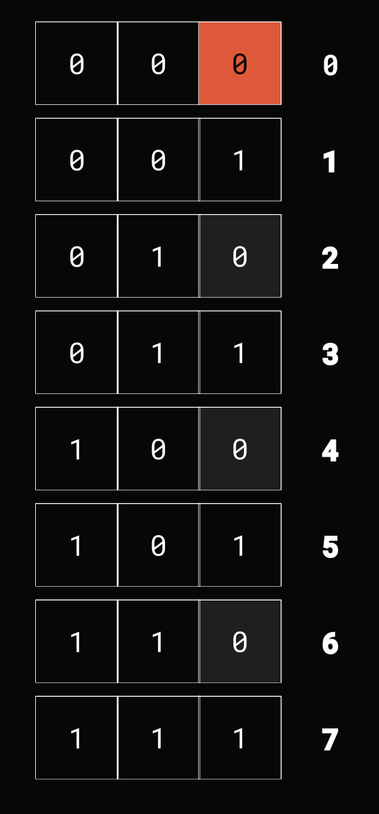

#### Как конвертировать байты, килобайты, мегабайты?

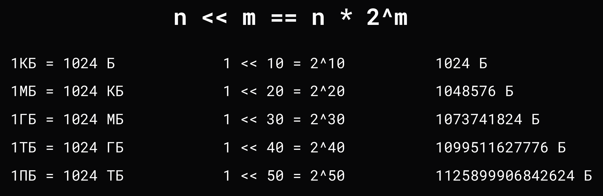

### Хранение и передача IPv4 адресов

Вместо того, чтобы хранить и передавать IPv4 адреса в строковом формате (до 15 байт), можно хранить любой адрес в 4 байтах.

[Решение](examples/ipv4_address/main.go)

```go
func Convert(address string) (uint32, error) {
    const octetsCount = 4
    segments := strings.Split(address, ".")
    if len(segments) != octetsCount {
        return 0, fmt.Errorf("invalid IPv4 address")
    }

    var result uint32 // also possible [4]byte
    for idx := 0; idx < octetsCount; idx++ {
        number, err := strconv.Atoi(segments[idx])
        if err != nil {
            return 0, err
        }

        if number < 0 || number > 255 {
            return 0, fmt.Errorf("invalid IPv4 address")
        }

        bitOffset := (octetsCount - idx - 1) * 8
        result |= uint32(number << bitOffset)
        fmt.Printf("%08b = %d\n", number, number)
    }

    return result, nil
}

func main() {
    address, _ := Convert("255.255.6.0")
    fmt.Printf("Address: %b = %d\n", address, address)
}
```

### Выносить операции с битами в функции

[Пример](examples/bit_wrappers/main.go)

```go
func IsSetBit(number, index int) bool {
    return (number & (1 << index)) != 0
}

func SetBit(number, index int) int {
    return number | (1 << index)
}

func InverseBit(number, index int) int {
    return number ^ (1 << index)
}

func ResetBit(number, index int) int {
    return number & ^(1 << index)
}
```
