# Lesson 2. Массивы и срезы

- [Lesson 2. Массивы и срезы](#lesson-2-массивы-и-срезы)
    - [Массивы](#массивы)
        - [Инициализация массива и API](#инициализация-массива-и-api)
        - [Синтаксический сахар](#синтаксический-сахар)
        - [Итерация по массиву](#итерация-по-массиву)
            - [Off by one error](#off-by-one-error)
            - [Уникальная переменная в range](#уникальная-переменная-в-range)
    - [Срезы (Slices)](#срезы-slices)
        - [Создание среза](#создание-среза)
        - [Добавление в конец](#добавление-в-конец)
        - [Расширение slice при добавлении элемента](#расширение-slice-при-добавлении-элемента)
        - [Создание "грязного" слайса без зануления данных](#создание-грязного-слайса-без-зануления-данных)
    - ["Нарезка" срезов](#нарезка-срезов)
        - [Проблемы из-за subslicing](#проблемы-из-за-subslicing)
        - [Как удалить элемент из конца среза?](#как-удалить-элемент-из-конца-среза)
        - [Как удалить элемент из начала среза?](#как-удалить-элемент-из-начала-среза)
        - [Как реаллоцировать емкость среза?](#как-реаллоцировать-емкость-среза)
    - [Тонкости срезов](#тонкости-срезов)
        - [Как очистить срез?](#как-очистить-срез)
        - [Пустые и нулевые срезы](#пустые-и-нулевые-срезы)
            - [А зачем различать пустые и нулевые срезы?](#а-зачем-различать-пустые-и-нулевые-срезы)
        - [Можно ли сравнивать срезы?](#можно-ли-сравнивать-срезы)
        - [Как скопировать данные среза? (DeepCopy)](#как-скопировать-данные-среза-deepcopy)
    - [Дополнительные материалы](#дополнительные-материалы)

## Массивы

`Массив` - структура данных фиксированного размера, хранящая последовательно элементы одного типа. Каждый элемент имеет индекс от 0 до n-1.

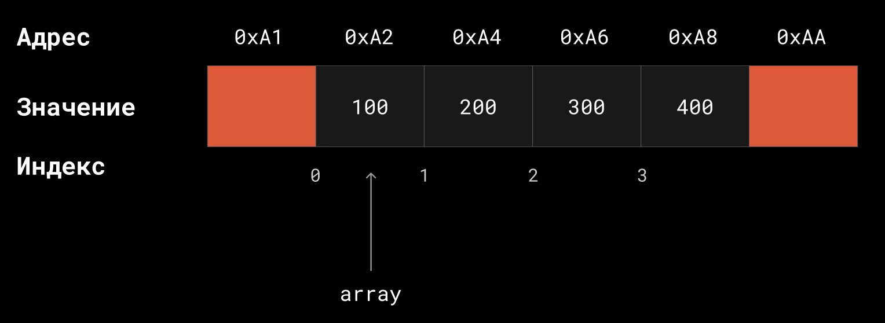

**Длина** (length) является частью типа массива. Следовательно, результат вызова функции `len()` для массива вычисляется на этапе компиляции, а не в runtime.

Массив в Go не имеет постоянного расположения в памяти на все время жизни программы (может переезжать, когда растет стек горутины).

Runtime Go аллоцирует массив в `stack`, **если его размер меньше или равен 10 МБ**. Иначе попадает в `heap`.

### Инициализация массива и API

**Инициализация массива:**
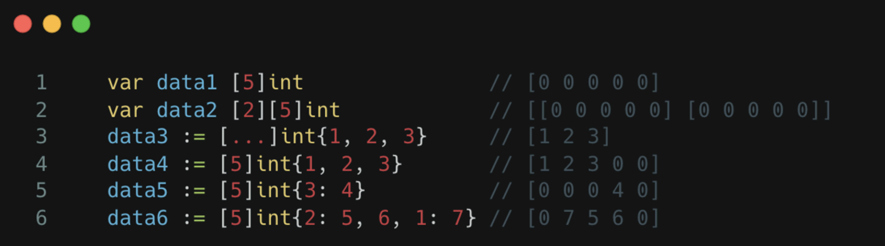

**API:**
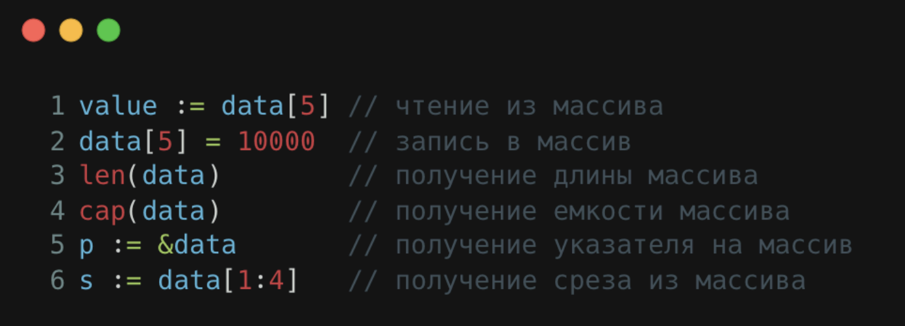

### Синтаксический сахар

[Пример](examples/access_by_index/main.go)

```go
const elemSize = unsafe.Sizeof(int32(0)) // 4 bytes
array := [...]int32{1, 2, 3}
pointer := unsafe.Pointer(&array)

first := *(*int32)(unsafe.Add(pointer, 0*elemSize))  // => data2[0]
second := *(*int32)(unsafe.Add(pointer, 1*elemSize)) // => data2[1]
third := *(*int32)(unsafe.Add(pointer, 2*elemSize))  // => data2[2]
```

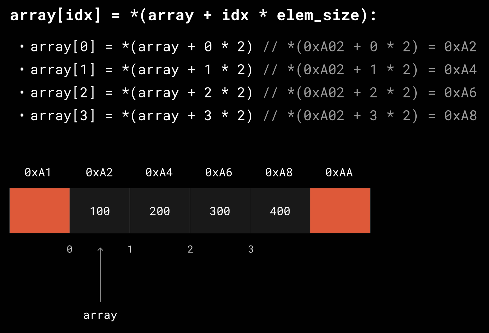

### Итерация по массиву

#### Off by one error

Это логическая ошибка в алгоритме, включающая вариант нарушения границы массива.

Возможна, если использовать классическую форму цикла:

```go
array := [5]int{1, 2, 3, 4, 5}
for i := 0; i <= len(array); i++ {
    // panic, когда i == len(array), так как индексация начинается с 0
    array[i]++
}

// panic: runtime error: index out of range [5] with length 5
```

Чтобы не допускать такого, можно использовать `range` loop (синтаксический сахар):

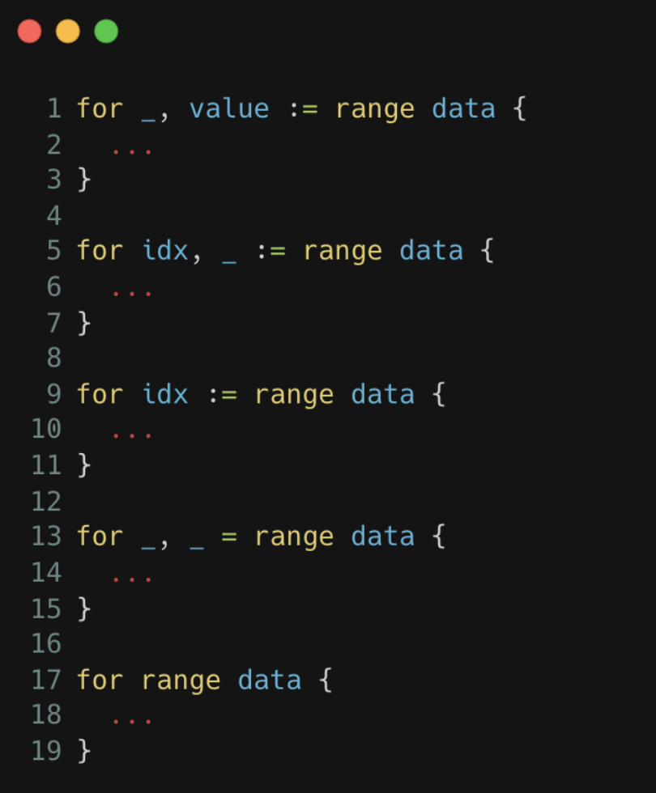

#### Уникальная переменная в range

Начиная с go 1.22 - уникальный экземпляр будет создан для каждой итерации:

```go
func main() {
    values := [...]int{100, 200, 300}

    // also actual for slices
    for idx, value := range values {
        value += 50
        fmt.Println("#1:", unsafe.Pointer(&value), "#2:", unsafe.Pointer(&values[idx]))
    }

    fmt.Println("values:", values)
}

// Output:
// #1: 0x1400000e0e0 #2: 0x14000014198
// #1: 0x1400000e0f0 #2: 0x140000141a0
// #1: 0x1400000e0f8 #2: 0x140000141a8
// values: [100 200 300]

// #1 - адрес переменной value в цикле
// #2 - адрес значения по индексу в массиве
```

## Срезы (Slices)

Slice содержит указатель на массив, его длину и вместимость. По сути является структурой данных динамического массива или списка.

Советы:

- возвращать слайс из функции, если добавляется во входящий слайс

Структура slice:

```go
type slice struct {
    array unsafe.Pointer
    len int
    cap int
}
```

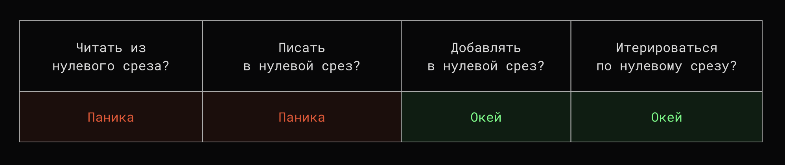

### Создание среза

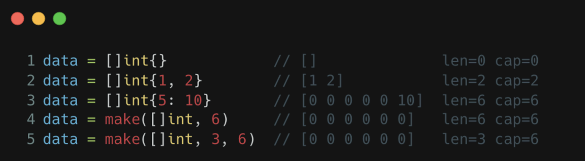

### Добавление в конец

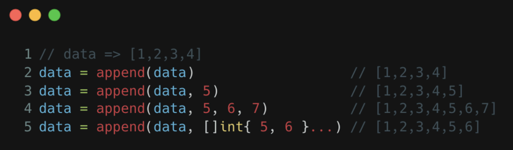

### Расширение slice при добавлении элемента

Если cap закончилась, но на нужно добавить элемент, то нам нужно создать новый underlay массив большего размера.

Алгоритм:

1. Выделяем больше памяти
2. Копируем элементы
3. Добавляем

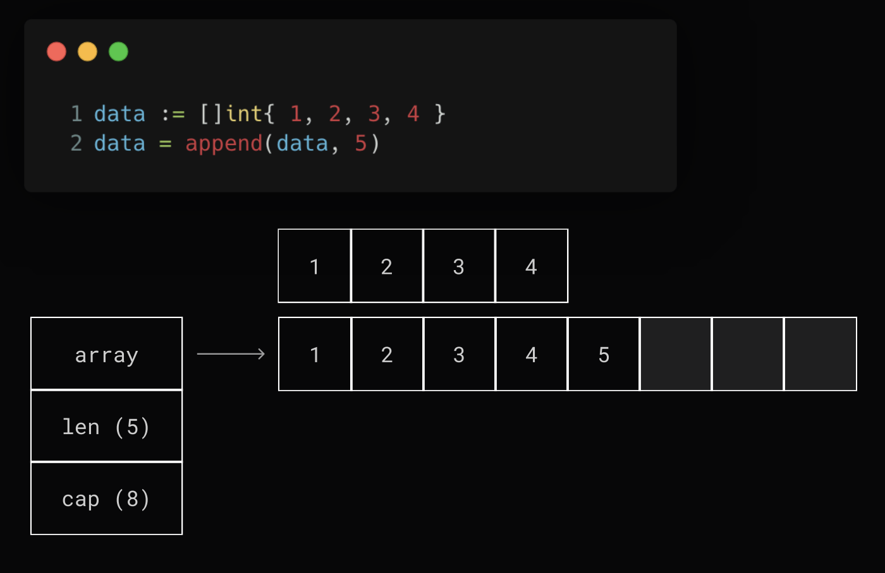

**Какого размера выделять новый массив?**

До 256 элементов массив растет в 2 раза, а далее по таблице:

| cap | growth factor |
| --- | ------------- |
| 256 | 2.0 |
| 512 | 1.63 |
| 1024 | 1.44 |
| 2048 | 1.35 |
| 4096 | 1.30 |

### Создание "грязного" слайса без зануления данных

Сделать это можно с помощью `strings.Builder` ([тык](examples/dirty_slice/creation_test.go)):

```go
// type Builder struct {
//     addr *Builder // of receiver, to detect copies by value

//     // External users should never get direct access to this buffer, since
//     // the slice at some point will be converted to a string using unsafe, also
//     // data between len(buf) and cap(buf) might be uninitialized.
//     buf []byte
// }

func makeDirty(size int) []byte {
    var sb strings.Builder
    // grow capacity up to `size`
    sb.Grow(size)

    // get *byte to start of the string
    pointer := unsafe.StringData(sb.String())
    // return slice of byte with `size` length and capacity
    return unsafe.Slice(pointer, size)
}
```

Таким образом мы получим слайс байт, но что если нам нужен слайс int?

[Решение]():

```go
// copy internal slice
type slice struct {
    data unsafe.Pointer
    len  int
    cap  int
}

func Transform(data []byte) []int {
    // get pointer to 1st element
    sliceData := unsafe.Pointer(&data[0])
    // get size of data type transform to
    sizeType := int(unsafe.Sizeof(0))
    // get length of new slice
    length := len(data) / sizeType

    var result []int
    // cast to our slice impl
    resultPtr := (*slice)(unsafe.Pointer(&result))
    resultPtr.data = sliceData
    resultPtr.len = length
    resultPtr.cap = length

    return result
}
```

## "Нарезка" срезов

Можно получить подсрез с помощью `[]`. Таким образом получается полуинтервал `[x;y)`, открытый слева и замкнутый справа.

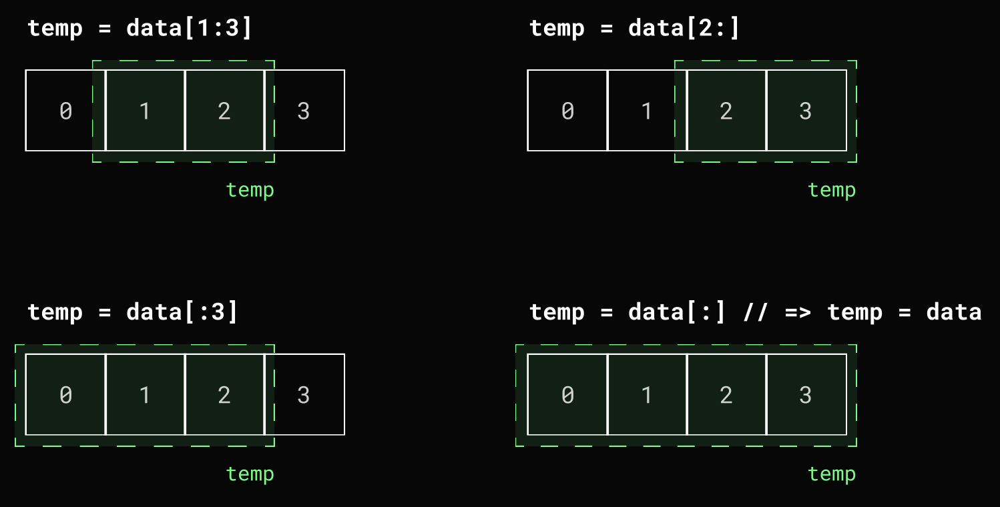

У subslicing синтаксис: `[x:y]` (или `[x:y:z]`), где

1. `x` - начало среза (включительно)
2. `y` - конец среза (не включительно, `len = y - x`; `cap = cap(original) - x`)
3. `z` (опционально) - емкость (`cap = z`)

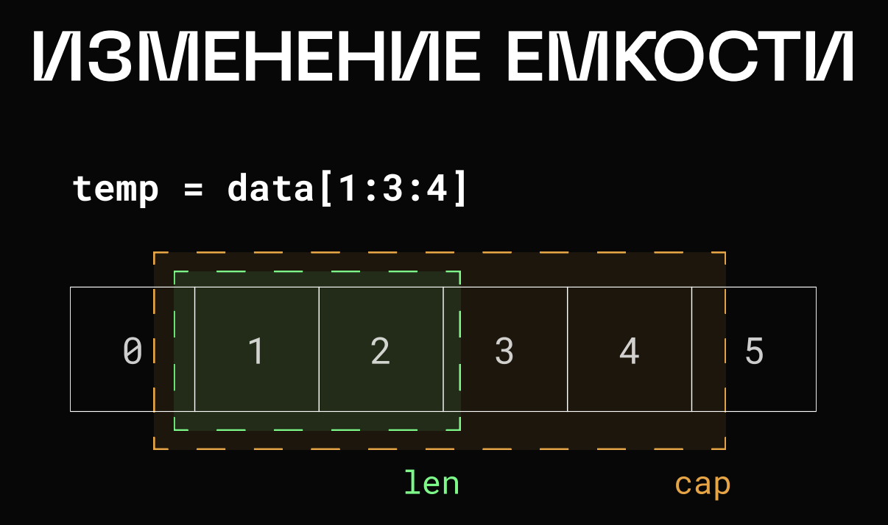

### Проблемы из-за subslicing

Есть 2 слайса, которые ссылаются на 1 участок памяти. **При изменении длины или емкость одного среза, эти изменения (то есть len и cap) никак не отражаются на другом срезе!**

Это неочевидное поведение, и может приводить к сложным и неприятным багам (меняется `len`):

```
Начало:
 sl1 len: 2; cap: 5
 sl2 len: 2; cap: 4

1 итерация (sl2 append 2):
 sl1: [0 0]
 sl2: [0 0 2]

2 итерация (sl1 append 1):
 sl1: [0 0 1]
 sl2: [0 1 2]

3 итерация (sl1 append 1):
 sl1: [0 0 1 1]
 sl2: [0 1 1]

4 итерация (sl1 append 1):
 sl1: [0 0 1 1 1]
 sl2: [0 1 1]

5 итерация (sl2 append 2):
 sl1: [0 0 1 1 2]
 sl2: [0 1 1 2]
```

Но если в какой-то момент изменяется `cap`, то для слайса создается новый underlay массив и теперь слайсы указывают на разные участки памяти:

```
До "РАЗЛОМА":
 sl1 len: 5; cap: 5
 sl2 len: 4; cap: 4

6 итерация (sl1 append 1) "РАЗЛОМ":
 sl1: [0 0 1 1 2 1]
 sl2: [0 1 1 2]

7 итерация (sl2 append 2) "РАЗЛОМ":
 sl1: [0 0 1 1 2 1]
 sl2: [0 1 1 2 2]

После "РАЗЛОМА":
 sl1 len: 6; cap: 10
 sl2 len: 5; cap: 8
```

Демо ([playground](https://play.golang.com/p/zIJ99_DuZpU), [local](examples/slicing_problems/main.go)):

```go
func main() {
    sl1 := make([]int, 2, 5)      // [0, 0, -, -, -] len = 2; cap = 5;
    sl2 := sl1[1:3]               //    [0, 0, -, -] len = 2; cap = 4;
    
    fmt.Printf("Начало:\n\tsl1 len: %d; cap: %d\n\tsl2 len: %d; cap: %d\n", len(sl1), cap(sl1), len(sl2), cap(sl2))
    
    fmt.Printf("\n1 итерация (sl2 append 2):\n")
    sl2 = append(sl2, 2)
    fmt.Printf("\tsl1: %v\n", sl1)  // [0, 0, -, -, -] len = 2; cap = 5;
    fmt.Printf("\tsl2: %v\n", sl2)  //    [0, 0, 2, -] len = 3; cap = 4;
    
    fmt.Printf("\n2 итерация (sl1 append 1):\n")
    sl1 = append(sl1, 1)
    fmt.Printf("\tsl1: %v\n", sl1)  // [0, 0, 1, -, -] len = 3; cap = 5;
    fmt.Printf("\tsl2: %v\n", sl2)  //    [0, 1, 2, -] len = 3; cap = 4;
    
    fmt.Printf("\n3 итерация (sl1 append 1):\n")
    sl1 = append(sl1, 1)
    fmt.Printf("\tsl1: %v\n", sl1)  // [0, 0, 1, 1, -] len = 4; cap = 5;
    fmt.Printf("\tsl2: %v\n", sl2)  //    [0, 1, 1, -] len = 3; cap = 4;
    
    fmt.Printf("\n4 итерация (sl1 append 1):\n")
    sl1 = append(sl1, 1)
    fmt.Printf("\tsl1: %v\n", sl1)  // [0, 0, 1, 1, 1] len = 5; cap = 5;
    fmt.Printf("\tsl2: %v\n", sl2)  //    [0, 1, 1, -] len = 3; cap = 4;
    
    fmt.Printf("\n5 итерация (sl2 append 2):\n")
    sl2 = append(sl2, 2)
    fmt.Printf("\tsl1: %v\n", sl1)  // [0, 0, 1, 1, 2] len = 5; cap = 5;
    fmt.Printf("\tsl2: %v\n", sl2)  //    [0, 1, 1, 2] len = 4; cap = 4;
    
    fmt.Printf("\nДо \"РАЗЛОМА\":\n\tsl1 len: %d; cap: %d\n\tsl2 len: %d; cap: %d\n", len(sl1), cap(sl1), len(sl2), cap(sl2))

    fmt.Printf("\n6 итерация (sl1 append 1) \"РАЗЛОМ\":\n")
    sl1 = append(sl1, 1)
    fmt.Printf("\tsl1: %v\n", sl1)  // [0, 0, 1, 1, 2, 1] len = 6; cap = 10; (new array)
    fmt.Printf("\tsl2: %v\n", sl2)  //    [0, 1, 1, 2]    len = 4; cap = 4;
    
    fmt.Printf("\n7 итерация (sl2 append 2) \"РАЗЛОМ\":\n")
    sl2 = append(sl2, 2)
    fmt.Printf("\tsl1: %v\n", sl1)  // [0, 0, 1, 1, 2, 1] len = 6; cap = 10;
    fmt.Printf("\tsl2: %v\n", sl2)  //    [0, 1, 1, 2, 2] len = 5; cap = 8;  (new array)


    fmt.Printf("\nПосле \"РАЗЛОМА\":\n\tsl1 len: %d; cap: %d\n\tsl2 len: %d; cap: %d\n", len(sl1), cap(sl1), len(sl2), cap(sl2))
}
```

### Как удалить элемент из конца среза?

```go
data := []int{1, 2, 3, 4}
data = data[:len(data) - 1] // [1, 2, 3]
```

### Как удалить элемент из начала среза?

А вот тут уже несколько способов.

1. (ПЛОХОЙ СПОСОБ) Аналогично удалению из конца, то есть мы берем сабслайс ([playground](https://play.golang.com/p/ff8iO3z-L83)):

```go
func main() {
    data := []int{1, 2, 3, 4}
    fmt.Printf("data = %v; len = %d; cap = %d;\n", data, len(data), cap(data))

    data = data[1:]
    fmt.Printf("data = %v; len = %d; cap = %d;\n", data, len(data), cap(data))

    data = data[1:]
    fmt.Printf("data = %v; len = %d; cap = %d;\n", data, len(data), cap(data))

    data = data[1:]
    fmt.Printf("data = %v; len = %d; cap = %d;\n", data, len(data), cap(data))

    data = data[1:]
    fmt.Printf("data = %v; len = %d; cap = %d;\n", data, len(data), cap(data))
}

// Output:
//  data = [1 2 3 4]; len = 4; cap = 4;
//  data = [2 3 4]; len = 3; cap = 3;
//  data = [3 4]; len = 2; cap = 2;
//  data = [4]; len = 1; cap = 1;
//  data = []; len = 0; cap = 0;

// Этот вариант плох тем, что мы теряем емкость слайса
```

2. (ЛУЧШЕ 1-го) Через `append()` ([playground](https://play.golang.com/p/HTMVwIZxjwZ)):

```go
func main() {
    data := []int{1, 2, 3, 4}
    fmt.Printf("data = %v; len = %d; cap = %d;\n", data, len(data), cap(data))

    data = append(data[:0], data[1:]...)
    fmt.Printf("data = %v; len = %d; cap = %d;\n", data, len(data), cap(data))

    data = append(data[:0], data[1:]...)
    fmt.Printf("data = %v; len = %d; cap = %d;\n", data, len(data), cap(data))

    data = append(data[:0], data[1:]...)
    fmt.Printf("data = %v; len = %d; cap = %d;\n", data, len(data), cap(data))

    data = append(data[:0], data[1:]...)
    fmt.Printf("data = %v; len = %d; cap = %d;\n", data, len(data), cap(data))
}

// Output:
//  data = [1 2 3 4]; len = 4; cap = 4;
//  data = [2 3 4]; len = 3; cap = 4;
//  data = [3 4]; len = 2; cap = 4;
//  data = [4]; len = 1; cap = 4;
//  data = []; len = 0; cap = 4;

// Этот вариант лучше первого, так как мы не теряем capacity
// Однако сложность алгоритма O(n), может быть есть что-то быстрее?
```

Кстати, таким образом можно удалять элементы из произвольного места в срезе ([playground](https://play.golang.com/p/N8niqI6-5g6)):

```go
func main() {
    data := []int{1, 2, 3, 4}
    fmt.Printf("data = %v; len = %d; cap = %d;\n", data, len(data), cap(data))

    data = append(data[:2], data[3:]...)
    fmt.Printf("data = %v; len = %d; cap = %d;\n", data, len(data), cap(data))
}

// Output:
//  data = [1 2 3 4]; len = 4; cap = 4;
//  data = [1 2 4]; len = 3; cap = 4;
```

От сюда **совет** - лучше избегать удаления из начала / середины слайса. А если это необходимо по алгоритму, то лучше использовать другую структуру данных, например "**связный список**".

3. (ЛУЧШЕ 2-го) Использовать пакет `slices` ([playground](https://play.golang.com/p/UL797-UxqXj)):

```go
func main() {
    data := []int{1, 2, 3, 4}
    fmt.Printf("data = %v; len = %d; cap = %d;\n", data, len(data), cap(data))

    data = slices.Delete(data, 2, 3)
    fmt.Printf("data = %v; len = %d; cap = %d;\n", data, len(data), cap(data))
}

// Output:
//  data = [1 2 3 4]; len = 4; cap = 4;
//  data = [1 2 4]; len = 3; cap = 4;
```

По сути тоже самое, что и во втором варианте, но проще читать.

### Как реаллоцировать емкость среза?

1. (**НЕПРАВИЛЬНО**) Напрямую `slices.Clip()` ([пример](examples/clip_incorrect/main.go)):

```go
func main() {
    data := make([]int, 10, 100<<20)
    fmt.Println("data:", unsafe.SliceData(data), len(data), cap(data))

    printAllocs()

    temp := slices.Clip(data) // data[:10:10]
    fmt.Println("temp2:", unsafe.SliceData(temp), len(temp), cap(temp))

    runtime.GC()
    printAllocs()

    runtime.KeepAlive(temp)
}

// Output:
//  data: 0x14000180000 10 104857600
//  800 MB
//  temp: 0x14000180000 10 10
//  800 MB

// но исходный массив на 800 Мб останется, новый не создается!
```

2. (**ПРАВИЛЬНО**) append в nil slice + `slices.Clip()` ([пример](examples/clip_correct/main.go)):

```go
func main() {
    data := make([]int, 10, 100<<20)
    fmt.Println("data:", unsafe.SliceData(data), len(data), cap(data))

    printAllocs()

    temp := append([]int(nil), slices.Clip(data)...)
    fmt.Println("temp:", unsafe.SliceData(temp), len(temp), cap(temp))

    runtime.GC()
    printAllocs()

    runtime.KeepAlive(temp)
}

// Output:
//  data: 0x14000180000 10 104857600
//  800 MB
//  temp2: 0x1400001a0f0 10 10
//  0 MB

// В этом случае создается новый nil слайс
// И туда копируются все элементы старого slice
```

## Тонкости срезов

### Как очистить срез?

Существует несколько способов ([пример](examples/slice_clearing/main.go)):

```go
func main() {
    // remove all elements
    first := []int{1, 2, 3, 4, 5}
    first = nil
    fmt.Println("first: ", first, " : ", len(first), " : ", cap(first))

    // keep allocated memory
    second := []int{1, 2, 3, 4, 5}
    second = second[:0]
    fmt.Println("second:", second, " : ", len(second), " : ", cap(second))

    // zero out all elements
    third := []int{1, 2, 3, 4, 5}
    clear(third)
    fmt.Println("third: ", third, " : ", len(third), " : ", cap(third))

    // zero two elements
    fourth := []int{1, 2, 3, 4, 5}
    clear(fourth[1:3])
    fmt.Println("fourth:", fourth, " : ", len(fourth), " : ", cap(fourth))
}

// Output:
//  first:  []  :  0  :  0
//  second: []  :  0  :  5
//  third:  [0 0 0 0 0]  :  5  :  5
//  fourth: [1 0 0 4 5]  :  5  :  5
```

### Пустые и нулевые срезы

- Срез считается `пустым`, если его **длина** равна `0`
- Срез считается `нулевым`, если его **значение** равно `nil`

Создание таких срезов ([пример](examples/empty_and_nil_slices/main.go)):

```go
func main() {
    var data []string
    fmt.Println("var data []string:")
    fmt.Printf("\tempty=%t nil=%t size=%d data=%p\n", len(data) == 0, data == nil, unsafe.Sizeof(data), unsafe.SliceData(data))

    data = []string(nil)
    fmt.Println("data = []string(nil):")
    fmt.Printf("\tempty=%t nil=%t size=%d data=%p\n", len(data) == 0, data == nil, unsafe.Sizeof(data), unsafe.SliceData(data))

    data = []string{}
    fmt.Println("data = []string{}:")
    fmt.Printf("\tempty=%t nil=%t size=%d data=%p\n", len(data) == 0, data == nil, unsafe.Sizeof(data), unsafe.SliceData(data))

    data = make([]string, 0)
    fmt.Println("data = make([]string, 0):")
    fmt.Printf("\tempty=%t nil=%t size=%d data=%p\n", len(data) == 0, data == nil, unsafe.Sizeof(data), unsafe.SliceData(data))

    empty := struct{}{}
    fmt.Println("empty struct address:", unsafe.Pointer(&empty))
}

// Output:
//  var data []string:
//          empty=true nil=true size=24 data=0x0
//  data = []string(nil):
//          empty=true nil=true size=24 data=0x0
//  data = []string{}:
//          empty=true nil=false size=24 data=0x104704500
//  data = make([]string, 0):
//          empty=true nil=false size=24 data=0x104704500
//  empty struct address: 0x104704500

// Обрати внимание, что пустые срезы ссылаются на тот же участок памяти
// Что и пустые структуры.
```

#### А зачем различать пустые и нулевые срезы?

Можно получить вот такой баг ([пример](examples/check_length/main.go)):

```go
func handleOperations(id string) {
    operations := getOperations(id)
    // bug is here
    // we got not nil, but empty slice
    if operations == nil {
        // handling...
    }
}

func getOperations(id string) []float32 {
    operations := []float32{}
    if id == "" {
        return operations
    }

    // adding operations...
    return operations
}
```

А чтобы его не получить, нужно проверять **длину** среза, это работает для проверки `пустых` и `нулевых` срезов:

```go
func handleOperations(id string) {
    operations := getOperations(id)
    // now it's OK
    if len(operations) == 0 {
        // handling...
    }
}

func getOperations(id string) []float32 {
    operations := []float32{}
    if id == "" {
        return operations
    }

    // adding operations...
    return operations
}
```

### Можно ли сравнивать срезы?

Напрямую через `==` НЕТ. Но можно использовать `reflect.DeepEqual()` ([пример](examples/slices_comparison/main.go)):

```go
func main() {
    data1 := []int{1, 2, 3, 4, 5}
    data2 := []int{1, 2, 3, 4, 5}

    // data1 == data2   ->   compilation error

    fmt.Println("equal:", reflect.DeepEqual(data1, data2))
}

// Output:
//  equal: true
```

Но у рефлексии есть проблемы с эффективностью. Она очень медленная и не очень пригодна для production.

Лучше использовать функцию `slices.Equal()` ([пример](examples/slices_comparison_effective/comparison_test.go) + bench inside):

```go
func equal(lhs, rhs []int) bool {
    if len(lhs) != len(rhs) {
        return false
    }

    for i := 0; i < len(lhs); i++ {
        if lhs[i] != rhs[i] {
            return false
        }
    }

    return true
}

func BenchmarkWithSlicesEqualFunction(b *testing.B) {
    // slices.Equal(lhs, rhs)
}

func BenchmarkWithOwnEqualFunction(b *testing.B) {
    // equal(lhs, rhs)
}

func BenchmarkWithReflect(b *testing.B) {
    // reflect.DeepEqual(lhs, rhs)
}

func BenchmarkWithSprint(b *testing.B) {
    // fmt.Sprint(lhs) == fmt.Sprint(rhs)
}

// Benchmark:
//  BenchmarkWithOwnEqualFunction-10        248199198          4.803 ns/op        0 B/op        0 allocs/op
//  BenchmarkWithSlicesEqualFunction-10     255957294          4.715 ns/op        0 B/op        0 allocs/op
//  BenchmarkWithReflect-10                  7140889        170.8 ns/op       48 B/op        2 allocs/op
//  BenchmarkWithSprint-10                   1000000       1023 ns/op      256 B/op       24 allocs/op
```

### Как скопировать данные среза? (DeepCopy)

Несколько способов:

1. Использовать функцию `copy()` (tricky one, [playground](https://play.golang.com/p/RvsfZ_BJTVc)):

```go
func main() {
    data := []int{1, 2, 3, 4}

    // обязательно создать с len исходного слайса
    copiedCorrect := make([]int, len(data))
    copy(copiedCorrect, data)

    copiedIncorrect := []int{}
    copy(copiedIncorrect, data)

    fmt.Printf("copiedCorrect == data\n%v == %v\n\n", copiedCorrect, data)
    fmt.Printf("copiedIncorrect != data\n%v != %v\n", copiedIncorrect, data)
}

// Output
//  copiedCorrect == data
//  [1 2 3 4] == [1 2 3 4]
//
//  copiedIncorrect != data
//  [] != [1 2 3 4]
```

2. С помощью `append()` with unpacking original slice to nil-slice ([playground](https://play.golang.com/p/ws1VNW3eN1_p)):

```go
func main() {
    data := []int{1, 2, 3, 4}
    copied := append([]int(nil), data...)
    fmt.Printf("copied == data\n%v == %v\n", copied, data)
}

// Output:
//  copied == data
//  [1 2 3 4] == [1 2 3 4]
```

3. С помощью `slices.Clone()` ([playground](https://play.golang.com/p/6p9_4bEluVd)):

```go
func main() {
    data := []int{1, 2, 3, 4}
    copied := slices.Clone(data)
    fmt.Printf("copied == data\n%v == %v\n", copied, data)
}

// Output:
//  copied == data
//  [1 2 3 4] == [1 2 3 4]
```

## Дополнительные материалы

1. [VictoriaMetrics Blog. Slices in Go: Grow Big or Go Home](https://victoriametrics.com/blog/go-slice/)
2. [Habr. О массивах и слайсах в Go](https://habr.com/ru/articles/739754/)
3. [Habr. Нарезаем массивы правильно в Go](https://habr.com/ru/articles/597521/)
4. [Habr. Go 1.21: пакет slices](https://habr.com/ru/articles/769056/)
5. [Programiz. Circular Queue Data Structure](https://www.programiz.com/dsa/circular-queue)
6. [go101. First Look of Custom Generics](https://go101.org/generics/444-first-look-of-custom-generics.html)
