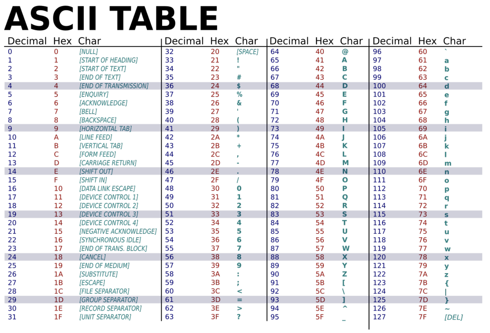
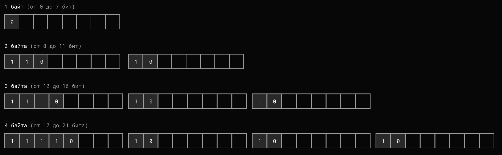
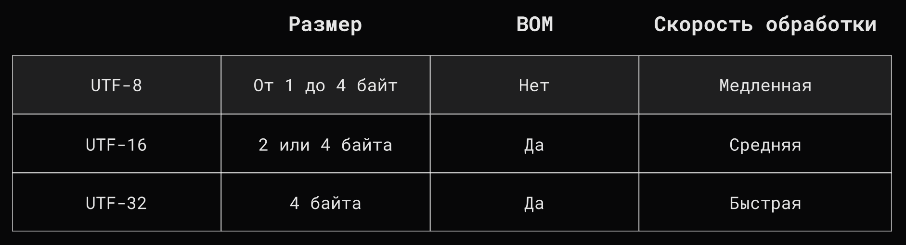
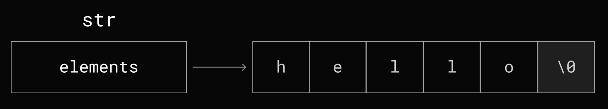
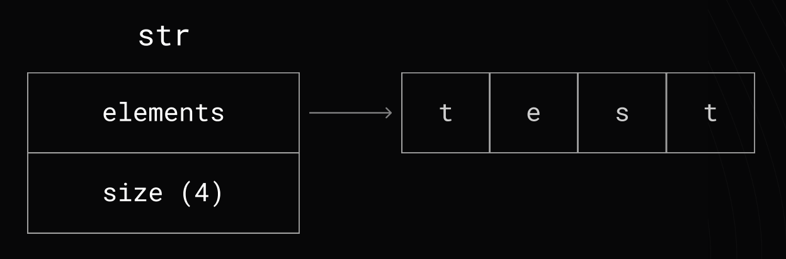
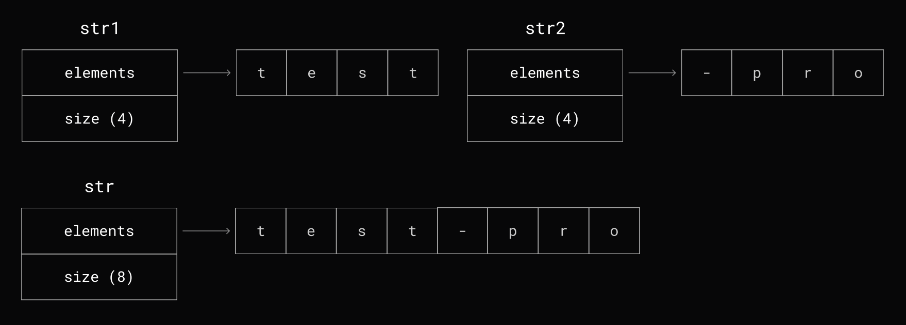
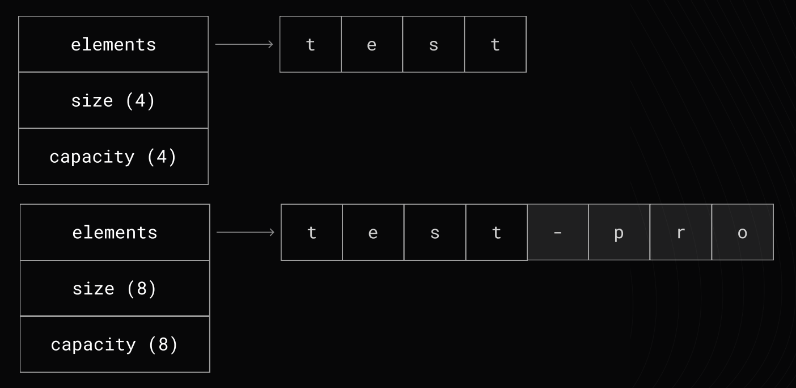
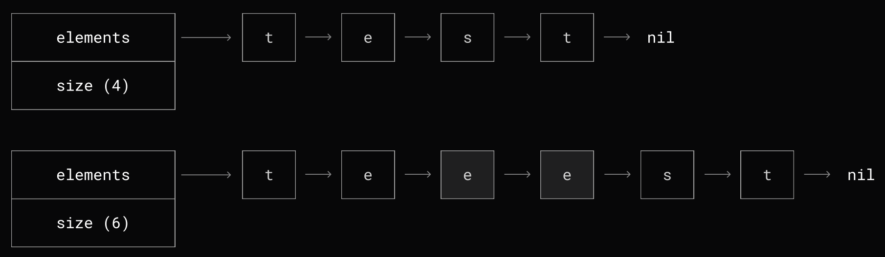
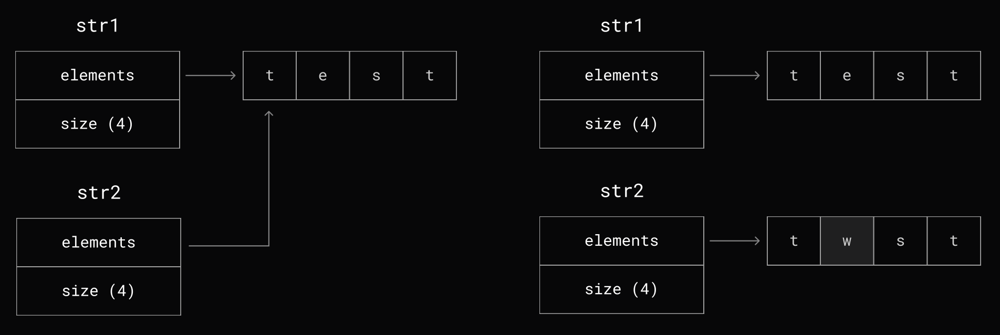
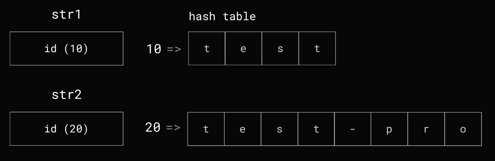

# Lesson 3. Строки

- [Lesson 3. Строки](#lesson-3-строки)
    - [Кодировки](#кодировки)
        - [ASCII](#ascii)
        - [Unicode](#unicode)
        - [UTF-8](#utf-8)
            - [ВОПРОС. Как битовые маски помогают определять из скольких байт состоит Little Endian символ, если первый байт начинается с 10 (как и все последующие)?](#вопрос-как-битовые-маски-помогают-определять-из-скольких-байт-состоит-little-endian-символ-если-первый-байт-начинается-с-10-как-и-все-последующие)
        - [UTF-16 \& UTF-32](#utf-16--utf-32)
        - [Сравнение UTF кодировок](#сравнение-utf-кодировок)
            - [ВОПРОС. А как BOM используется в UTF-16 и UTF-32? То есть размер любого символа UTF-32 - 6 байт?](#вопрос-а-как-bom-используется-в-utf-16-и-utf-32-то-есть-размер-любого-символа-utf-32---6-байт)
    - [Виды строк](#виды-строк)
        - [Нуль-терменированные строки (C)](#нуль-терменированные-строки-c)
        - [Pascal строки (Pascal)](#pascal-строки-pascal)
        - [Неизменяемые строки (Go, Java, C#, JavaScript)](#неизменяемые-строки-go-java-c-javascript)
        - [Изменяемые строки (С++)](#изменяемые-строки-с)
        - [Списки символов (Erlang, Haskell)](#списки-символов-erlang-haskell)
        - [COW (copy-on-write) строки](#cow-copy-on-write-строки)
            - [ВОПРОС. Есть ли языки программирования, которые используют Copy-On-Write строки? Если нет, то почему (идея же крутая)?](#вопрос-есть-ли-языки-программирования-которые-используют-copy-on-write-строки-если-нет-то-почему-идея-же-крутая)
        - [Интернирование строк](#интернирование-строк)
    - [Тонкости строк в Go](#тонкости-строк-в-go)
        - [Интерпретируемые и "сырые" строки в Go](#интерпретируемые-и-сырые-строки-в-go)
        - [Конкатенация строк](#конкатенация-строк)
        - [Итерирование по строке](#итерирование-по-строке)
    - [Дополнительные материалы](#дополнительные-материалы)

## Кодировки

`Строка` - тип данных, значениями которого является **произвольная** последовательность символов.

Но чтобы одни и те же числа отображались на разных компьютерах одинаково - нужен **стандарт по кодированию** этих символов.

### ASCII

**A**merican **S**tandart **C**ode for **I**nformation **I**nterchange - в этом стандарте выделяется 8 бит, но используется только 7:

- от 0 до 127 (128 значений)
- с 0 до 31 - управляющие символы
- с 31 до 127 - символы, имеющие внешний вид
- свободные значения с 128 до 255



### Unicode

Первые 128 символов `Unicode` одинаковые c `ASCII`. В первой версии использовалось 2 байта для хранения (65536 символов).

Но тут возникают проблемы:

1. **Излишнее потребление памяти**. Когда в `ASCII` строка "HI" хранилась в 2 байтах, теперь нужно 6 байт (4 bytes for chars and 2 bytes for `BOM`).
2. **Порядок следования байтов**. Теперь, когда у нас 2 байта, порядок (`Big` / `Little Endian`) имеет значение. Чтобы решить эту проблему, появился стандарт `UCS-2`, который добавил 2 дополнительных байта `BOM` (unicode byte order mask = `[FE,FF]`). Если в начале строки порядок `[FE,FF]`, то это `Big Endian`, иначе `Little Endian`.

### UTF-8

Новая кодировка, которая пришла на замену `Unicode`. Идея заключается в том, чтобы сделать коды символов не фиксированной, а **переменной** длины **от 1 до 4 байт** - первые 128 символов `UTF-8` совпадают с `ASCII`.

Вместо BOM используются маски кодов - если `Big Endian`, то первый байт будет начинаться с [`0`, `110`, `1110`, `11110`], а если `Little Endian`, то первый байт будет начинаться с `10`.



**Какие проблемы у UTF-8?**

Переменная длина символов увеличила время обработки строк, так как каждый символ нужно проверять на его длину. Из-за этого некоторые языки программирования стали использовать другие кодировки.

#### ВОПРОС. Как битовые маски помогают определять из скольких байт состоит Little Endian символ, если первый байт начинается с 10 (как и все последующие)?

### UTF-16 & UTF-32

- `UTF-16` кодирует символ либо 2 байтами, либо 4.
- `UTF-32` всегда кодирует любой символ 4 байтами.

### Сравнение UTF кодировок



#### ВОПРОС. А как BOM используется в UTF-16 и UTF-32? То есть размер любого символа UTF-32 - 6 байт?

## Виды строк

### Нуль-терменированные строки (C)

Идея заключается в использовании завершающего байта - как правило, символ с кодом `\0` выбирается в качестве признака конца строки. Сама строка в таком случае является массивом символов.



### Pascal строки (Pascal)

Идея заключается в использовании отдельного места в памяти для хранения размера строки.



### Неизменяемые строки (Go, Java, C#, JavaScript)

Такие строки **нельзя изменить**. Как правило, конкатенация строк возвращает новую строку.



### Изменяемые строки (С++)

Такие строки **можно изменять**. Как правило, underlay массив растет аналогично динамическому массиву (slice в Go).



### Списки символов (Erlang, Haskell)

Строка представляется в виде связного списка символов.



### COW (copy-on-write) строки

При чтении строки используется общая память, а в случае изменения - создается копия.



#### ВОПРОС. Есть ли языки программирования, которые используют Copy-On-Write строки? Если нет, то почему (идея же крутая)?

### Интернирование строк

Храним в памяти только один экземпляр строки для идентичных строк.



## Тонкости строк в Go

- Строки используются как **константы**, то есть являются неизменяемыми (immutable);
- Строки можно **конкатенировать** с использованием операторов `+` и `+=`;
- Строки можно **сранивать** с использованием операторов `!=`, `==`, `<`, `>`, `<=`, `>=`. Строки сравниваются друг с другом байт за байтом (Лексикографически);
- Можно узнать **длину строки** с использованием функции `len(s)`;
- Можно **обратиться к N-ому байту** с использованием оператора `[N]` - `char := str[5]`;
- Можно **получить подстроку** с использованием оператора слайсинга `[x:y]` - `substring := str[2:8]`. Результатом будет **строка**, а не срез;
- Строки можно **конвертировать** в `[]byte` & `[]rune` и наоборот. Но при конвертации будет **аллокация памяти**, так как строки неизменяемые в отличие от срезов;
- При передаче строки в функцию, **копируется только структура**, то есть указатель на underlying слайс байт и длина строки;
- **Нельзя** взять указатель на один байт строки;
- **Нельзя** напрямую конвертировать `[]rune` в `[]byte` и наоборот. Но для конвертации `[]byte` -> `[]rune` есть `bytes.Runes(b []byte)`, а вот для `[]rune` -> `[]byte` нужно писать свою реализацию;

Строка в `Go` устроена так:

```go
type _string struct {
    elements *byte // underlying bytes
    len      int   // number of bytes
}
```

Для символов в `Go` существует отдельный тип данных `rune`, который является alias'ом типа `int32`.

### Интерпретируемые и "сырые" строки в Go

```go
func main() {
    interpreted := "\nHello\nworld!\n"
    raw := `\nHello\nworld!\n`

    fmt.Println(interpreted)
    fmt.Println(raw)

    interpretedData := []byte("\n")
    rawData := []byte(`\n`)

    fmt.Println("interpretedData:", interpretedData)
    fmt.Println("rawData:", rawData)
}

// Output:
//  
//  Hello
//  world!
//  
//  \nHello\nworld!\n
//  interpretedData: [10]
//  rawData: [92 110]
```

### Конкатенация строк

Есть разные способы конкатенации от худшего к лучшему:

1. `s3 := fmt.Sprintf("%s%s", s1, s2)` (рефлексия внутри, супер медленно)
2. `s3 := strings.Join([]string{s1, s2}, "")` (быстрее 1, но тоже медленно)
3. `s3 := s1 + s2` (внутренняя оптимизация, в 5-8 раз быстрее первого)
4. `b := strings.Builder; b.WriteString(s1); b.WriteString(s2); s3 := b.String()` (гораздо быстрее всех!)

### Итерирование по строке

Есть 2 способа итерироваться по строке:

1. По рунам:

    ```go
    text := "Sr, привет 世界"
    for idx, symbol := range text { // range []rune(text)
        fmt.Printf("%d-%c ", idx, symbol)
    }
    // Output:
    //  0-S 1-r 2-, 3-  4-п 6-р 8-и 10-в 12-е 14-т 16-  17-世 20-界
    ```

2. По байтам:

    ```go
    for i := 0; i < len(text); i++ { // range []byte(text)
        fmt.Printf("%d-%c ", i, text[i])
    }
    // Output:
    //  0-S 1-r 2-, 3-  4-Ð 5-¿ 6-Ñ 7- 8-Ð 9-¸ 10-Ð 11-² 12-Ð 13-µ 14-Ñ 15- 16-  17-ä 18-¸ 19- 20-ç 21- 22- 
    ```

## Дополнительные материалы

1. [wiki. ASCII](https://www.wikiwand.com/ru/articles/ASCII)
2. [wiki. Code Page](https://www.wikiwand.com/ru/articles/Кодовая_страница)
3. [joelonsoftware. The Absolute Minimum Every Software Developer Absolutely, Positively Must Know About Unicode and Character Sets (No Excuses!)](https://www.joelonsoftware.com/2003/10/08/the-absolute-minimum-every-software-developer-absolutely-positively-must-know-about-unicode-and-character-sets-no-excuses/)
4. [kunststube. What every programmer absolutely, positively needs to know about encodings and character sets to work with text](https://kunststube.net/encoding/)
