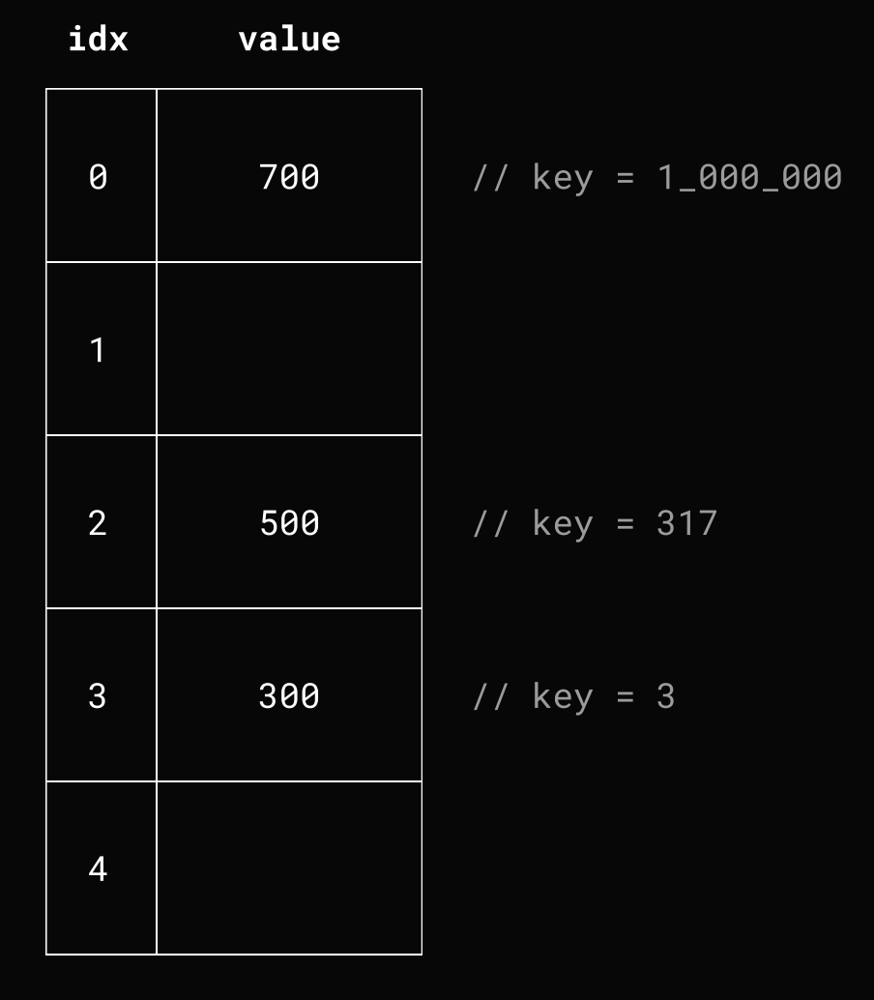

# Lesson 4. Хэш-таблицы

- [Lesson 4. Хэш-таблицы](#lesson-4-хэш-таблицы)
    - [Устройство хэш-таблиц](#устройство-хэш-таблиц)
        - [1. Массив пар](#1-массив-пар)
        - [2. Direct accessing](#2-direct-accessing)
        - [3. Хэш-функция](#3-хэш-функция)
            - [Свойства хорошей хэш-функции](#свойства-хорошей-хэш-функции)
            - [Примитивная хэш-функция](#примитивная-хэш-функция)
            - [Коллизии](#коллизии)
                - [Метод цепочек](#метод-цепочек)
            - [Метод открытой адресации](#метод-открытой-адресации)
    - [Внутреннее устройство словарей в Go](#внутреннее-устройство-словарей-в-go)
        - [Как устроен бакет?](#как-устроен-бакет)
            - [?](#)
        - [Когда происходит увеличение кол-ва бакетов?](#когда-происходит-увеличение-кол-ва-бакетов)
        - [Как происходит работа с map в Go?](#как-происходит-работа-с-map-в-go)
    - [Тонкости словарей в Go](#тонкости-словарей-в-go)
        - [А почему порядок чтения из map не определен?](#а-почему-порядок-чтения-из-map-не-определен)
    - [Дополнительные материалы](#дополнительные-материалы)

## Устройство хэш-таблиц

Задача:

- хранить пару id пользователя с его балансов
- быстро искать баланс пользователя по его id

Варианты решения:

### 1. Массив пар

Будет работать медленно, так как в худшем случае придется пробегаться по всему массиву, чтобы найти в нем значение.


### 2. Direct accessing

Работает быстро, но массив получается **разряженным** - если нужно хранить не инкрементальные id, то у нас будут пустые места в массиве (например, когда 5 пользователей, но максимальный id пользователя равен 1_000_000)


### 3. Хэш-функция

#### Свойства хорошей хэш-функции

1. **Эффективность** - вычисление преобразования не должно занимать много времени;
2. **Необратимость** - не должно быть функции для обратного преобразования (например, `f1(547) => 3`, `f2(3) !=> 547`);
3. **Детерминированность** - для одного и того же ключа должна возвращать один и тот же результат;
4. **Распределенность** - должна равномерно распределять данные по множеству (например, не должна всегда возвращать 0).

#### Примитивная хэш-функция

`F(x, capacity) = x % capacity`

Пример:

- `Insert(3, 300)` => `F(3, 5)` = `3 % 5` = `3`
- `Insert(317, 500)` => `F(317, 5)` = `317 % 5` = `2`
- `Insert(1_000_000, 700)` => `F(1_000_000, 5)` = `1_000_000 % 5` = `0`



#### Коллизии

**Коллизия** - ситуация, когда для разных ключей мы получаем один и тот же результат хэш-функции. Коллизии неизбежны, так как мы из большого множества хэшируем в маленькое, но наша задача научиться с ними работать.

Разрешения коллизий:

1. Метод цепочек
2. Метод открытой адресации

##### Метод цепочек

Допустим мы создаем таблицу с 4 "бакетами":


Затем, вставляем в таблицу ключ 5 со значением 200:


Здесь в качестве цепочек можно использовать не только связные списки, но и массивы, деревья и т.д.

Затем, вставляем ключ 3 со значением 300:


И добавим ключ 9 со значением 900:


А теперь получим ключ 9 (коллизия, в бакете несколько значений, но тут мы просто линейным поиском ищем нужный ключ):


Удаление работает так же:


---

Но тут мы сталкиваемся с проблемой - если хэш-таблица не будет расширяться (кол-во бакетов), то коллизий будет все больше и больше.

Здесь появляется понятие `Load Factor` - это коэффициент загруженности хэш-таблицы, считается по формуле: `f = size / bucket_size`. В большинстве реализаций, когда коэффициент больше 0.6 - 0.7, то происходит **переиндексация**.

Переиндексация хэш-таблицы практически тоже самое, что и реаллокация памяти для динамического массива, но разница в том, что мы **не можем просто бездумно копировать элементы**. Потому что при реиндексации мы выделяем в 2 раза больше памяти и из-за этого меняется capacity, который влияет на результат хэш-функции:

```go
F(5, 4) = 5 % 4 (capacity) = 1 // old map
F(5, 8) = 5 % 8 (capacity) = 5 // new map after reindex

1 != 5 // critical problem
```

**Как правильно переиндексировать?**

Для каждого элемента нужно пересчитать результат хэш-функции и при необходимости перенести элемент в другой бакет:


#### Метод открытой адресации

Рассмотрим другую реализацию со слотами. Создаем хэш-таблицу с 4 слотами и вставляем туда ключ 5 со значением 500:


Добавим ключ 3 со значением 300:


Теперь добавим 9, но тут слот оказался занятым:


Нужно пробировать. Идем по массиву, пока не найдем свободное место:


При такой реализации, нужно так же переиндексировать таблицу, когда коэффициент больше 60-70%.

Реализация хэш-функции методом открытой адресации более кэш-дружелюбная структура данных, однако поиск работает хуже.

## Внутреннее устройство словарей в Go

Внутренняя структура hash-map в Go в структуре hmap ([source code](https://github.com/golang/go/blob/master/src/runtime/map_noswiss.go#L115)):

1. `count int` - кол-во элементов
2. `flags uint8` - ?
3. `B uint8` - двоичный логарифм кол-ва бакетов (?)
4. `noverflow uint16` - ?
5. `hash0 uint32` - hash seed (?)
6. `buckets unsafe.Pointer` - массив бакетов
7. `oldbuckets unsafe.Pointer` - массив старых бакетов до переиндексации
8. `nevacuate uintptr` - ?
9. `extra *mapextra` - ?

```go
type hmap struct {
    // Note: the format of the hmap is also encoded in cmd/compile/internal/reflectdata/reflect.go.
    // Make sure this stays in sync with the compiler's definition.
    count     int // # live cells == size of map.  Must be first (used by len() builtin)
    flags     uint8
    B         uint8  // log_2 of # of buckets (can hold up to loadFactor * 2^B items)
    noverflow uint16 // approximate number of overflow buckets; see incrnoverflow for details
    hash0     uint32 // hash seed

    buckets    unsafe.Pointer // array of 2^B Buckets. may be nil if count==0.
    oldbuckets unsafe.Pointer // previous bucket array of half the size, non-nil only when growing
    nevacuate  uintptr        // progress counter for evacuation (buckets less than this have been evacuated)
    clearSeq   uint64

    extra *mapextra // optional fields
}
```


Словарь / карта / map в Go - это **указатель на структуру hmap**. Это означает, что map можно передавать в функции **без дополнительного указателя** ([пример](examples/map_with_function_1/main.go)):

```go
func set(data map[int]int, key, value int) {
    data[key] = value
}

func main() {
    data := make(map[int]int)
    fmt.Println(data)
    set(data, 100, 500)
    fmt.Println(data)
}

// Output:
//  map[]
//  map[100:500]
```

---

**Тип данных ключа должен быть сравниваемым, но почему?**

Потому что нужно сравнивать ключи, при возникновении коллизий (в Go используется метод цепочки).

У каждого словаря разное `hash seed` значение, поэтому у каждого объекта словаря будут **абсолютно разные хэш-значения** для ключей.

---

**Как определить начальное кол-во бакетов при инициализации хэш-мапы?**

Использовать функцию `make(map[T]T, N)`, функция `make()` выделяем место как минимум под `N` элементов и создает бакеты по таблице:


### Как устроен бакет?

#### ?

Bucket представляет собой массив из `8 элементов ключ-значение`, `нескольких байт оптимизации` и `указателя overflow`, который ссылается на след. bucket (? почему вообще может не хватить мест в бакете?):

([source code](https://github.com/golang/go/blob/master/src/runtime/map_noswiss.go#L150))

```go
type bmap struct {
    // tophash generally contains the top byte of the hash value
    // for each key in this bucket. If tophash[0] < minTopHash,
    // tophash[0] is a bucket evacuation state instead.
    tophash [abi.OldMapBucketCount]uint8
    // Followed by bucketCnt keys and then bucketCnt elems.
    // NOTE: packing all the keys together and then all the elems together makes the
    // code a bit more complicated than alternating key/elem/key/elem/... but it allows
    // us to eliminate padding which would be needed for, e.g., map[int64]int8.
    // Followed by an overflow pointer.
}
```


**А зачем нужен tophash (байты оптимизации)?**

`tophash` - старшие 8 бит хэша ключа. Помогают определить, может ли ключ быть в бакете.

Когда вы хотите добавить, удалить или найти элемент, речь идет не только о проверке наличия места в бакете, но и о сравнении ключа с каждый существующим ключом в этом бакете (становится еще хуже, когда есть бакеты переполнения (`overflow`)).

Описание оптимизации - если после сравнения `tophash` они совпадают, это означает, что ключи *могут* быть одинаковыми - затем Go переходит к более медленному процессу проверки идентичности ключей.


### Когда происходит увеличение кол-ва бакетов?

Увеличение кол-ва бакето происходит, когда коэффициент заполненности хэш-таблицы равен 80%, что примерно равно 6.5 элементам в каждом бакете (кол-во бакетов увеличивается в 2 раза).

И происходит эвакуация. **Эвакуация** - процесс перераспределения бакетов, но она происходит инкрементально при операциях записи и удаления ключей. Выглядит сложно, но у такого инкрементального подхода к эвакуации есть плюс: **не будет больших пауз во время переиндексации больших hashmap**.


### Как происходит работа с map в Go?

В Go map реализован на основе unsafe.Pointer, что позволяет менять его поведение в разных ситуациях:


## Тонкости словарей в Go

- Не хранят данные, отсортированные по ключу
- **Не сохраняют порядок**, в котором были добавлены данные
- Тип ключа словаря должен быть **сравниваемым**
- При итерации порядок не **определен**
- Если значение в **map > 128 байт**, то Go хранит не само значение, а **указатель** на него
- Удаление из map не влияет на кол-во бакетов. Решение - либо переодически **очищать словарь** (`clear()`), либо **использовать указатели** в качестве значений
- СОВЕТ: резервируйте емкость словаря `make(map[int]int, N)`, если известно заранее будущее кол-во элементов

### А почему порядок чтения из map не определен?

Разработчики Go решили добавить элемент случайности, чтобы программисты никогда не основывались на предположениях об упорядочивании hashmap.

## Дополнительные материалы
