# Lesson 5. Функции

- [Lesson 5. Функции](#lesson-5-функции)
    - [Функции](#функции)
        - [Copy elision (которого нет)](#copy-elision-которого-нет)
        - [Прототипы функции Go (да-да, не удивляйтесь)](#прототипы-функции-go-да-да-не-удивляйтесь)
        - [Встраивание функций (inlining)](#встраивание-функций-inlining)
    - [defer](#defer)
    - [Функциональное программирование](#функциональное-программирование)
        - [Паттерны и приемы функционального программирования](#паттерны-и-приемы-функционального-программирования)
            - [Декоратор (decorator)](#декоратор-decorator)
            - [Композиция (composition)](#композиция-composition)
            - [Замыкания (closures)](#замыкания-closures)
            - [Каррирование (currying)](#каррирование-currying)
            - [Ленивые вычисления (lazy evaluation)](#ленивые-вычисления-lazy-evaluation)
            - [Continuation (Программирование в стиле передачи продолжений)](#continuation-программирование-в-стиле-передачи-продолжений)
            - [Рекурсия (recursion)](#рекурсия-recursion)
            - [Мемоизация (memoization)](#мемоизация-memoization)
    - [Устройство аппаратного стека](#устройство-аппаратного-стека)
        - [Регистры (указатели)](#регистры-указатели)
        - [Основные команды](#основные-команды)
        - [Фрейм функции (тут и далее не осилил, добей как нибудь)](#фрейм-функции-тут-и-далее-не-осилил-добей-как-нибудь)
    - [Дополнительные материалы](#дополнительные-материалы)

## Функции

- `Функция` - это фрагмент кода, к которому можно обратиться из другого места программы. С именем функции связан адрес первой инструкции функции, которой передается управление при обращении к функции;
- `Сигнатура функции` - это список состоящий из: названия функции, тела функции, входных параметров и результирующих значений;
- **Все аргументы при передаче в функцию копируются!**;
- В Go функции первого порядка, т.е. они ведут себя как переменные: их **можно присваивать**, **передавать** и **возвращать**, но **НЕ** сравнивать и брать адрес;
- Zero-value функции = `nil`;
- Можно создавать сколько угодно функций `init()`;
- В Go есть **анонимные функции**, т.е. функции, которые определяются в месте использования и не имеют имени:

    ```go
    // создание анонимной функции, можно потом вызывать f()
    f := func(a, b int) int {
        return a + b
    }

    // сразу вызвать анонимную функцию
    // sum == 15
    sum := func(a, b int) int {
        return a + b
    }(5, 10)
    ```

- В Go есть `variadic parameters`. Могут быть только последними в списке аргументов и только 1 var.param для 1 функции:

    ```go
    // здесь tokens на самом деле является []int
    func process(data string, tokens ...int) {
        // some magic
    }

    func main() {
        process("")
        process("", 1)
        process("", 1, 2, 3)
        process("", []int{1, 2, 3}...)
    }
    ```

- Не нужно мешать именованный и неименованный return в рамках одной функции:

    ```go
    func GetLocation(address string) (lat, lon float32, err error) {
        if address == "" {
            // либо так
            return
        }
        // либо так
        return lat, lon, err
    }
    ```

Встроенные функции:

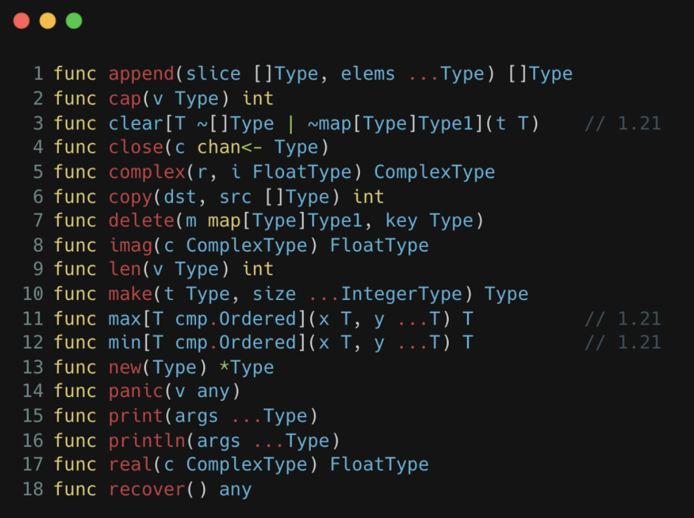

### Copy elision (которого нет)

В Go **нет** `RVO` (Return Value Optimization) и `NRVO` (Named Return Value Optimization).

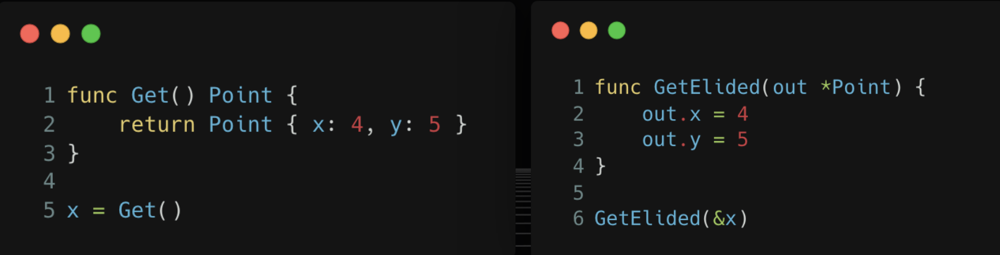

Подробнее:

- (youtube) [C++ (N)RVO | Copy ellision | Оптимизации компилятора](https://www.youtube.com/watch?v=ax5Fh8PQv84)
- (habr) [RVO и NRVO в C++17](https://habr.com/ru/companies/vk/articles/666330/)

### Прототипы функции Go (да-да, не удивляйтесь)

В Go есть прототипы функций, т.е. объявление функции без тела:

```go
func Double(number int) int
```

**А зачем они нужны?** Например, для реализации GoAssembly: создаем прототип в Go, реализуем на ассемблере, но вызываем из Go.

### Встраивание функций (inlining)

```go
func add(x, y int) int {
    return x + y
}

func main() {
    x := 5
    y := 5
    z := add(x, y)
    // на самом деле происходит inlining
    z := x + y 
    _ = z
}
```

Но мы можем явно сказать компилятору, чтобы он не встраивал функцию:

```go
//go:noinline
func sum(a, b int) int {
    // magic
}
```

## defer

`defer` - это ключевое слово, которое позволяем запланировать запуск функции до ее возврата. `defer` часто используется для очистки ресурсов или завершения задач.

---

**ВАЖНО**: функция откладывается с заранее вычисленными аргументами!

Решение (примеры ниже):

1. Использовать замыкания
2. Использовать указатели

[Пример](examples/defer_with_function/main.go):

```go
func get() string {
    fmt.Println("1")
    return ""
}

func handle(string) {
    fmt.Println("3")
}

func process() {
    // вот тут мы вычисляем аргумент сразу
    defer handle(get())
    fmt.Println("2")
}

func main() {
    process()
}

// Output:
//  1
//  2
//  3
```

Второй [пример](examples/defer_calculating/main.go):

```go
const (
    StatusOk    = "ok"
    StatusError = "error"
)

func notify(status string) {
    fmt.Println(status)
}

func process() {
    var status string
    defer func(s string) {
        notify(s)
    }(status)

    // processing..
    status = StatusError
}

func process_correct1() {
    var status string
    defer func() {
        // используем замыкание
        notify(status)
    }()

    // processing..
    status = StatusError
}

func process_correct2() {
    var status string
    // используем указатель на строку
    defer func(s *string) {
        notify(s)
    }(&status)

    // processing..
    status = StatusError
}

func main() {
    // в таком виде будет пустая строка, так как мы получили status до вызова
    process()
    // функция с замыканием, отработает как надо
    process_correct1()
    // функция с указателем в defer, так же отработает как надо
    process_correct2()
}

```

Что происходит под капотом:

```go
// наша функция
func run() {
    defer foo()
    defer bar()
    println("hello")
}

// что происходит
runtime.deferproc(foo)
runtime.deferproc(bar)

// ... run our code

runtime.deferreturn()
// и выполняем в обратном порядке
// bar()
// foo()
```

## Функциональное программирование

- `Функция` - возвращает значение
- `Процедура` - вызывается ради побочных эффектов (выводит на экран или изменяет состояние)
- `Предикат` - функция, которая возвращает логическое значение
- `Функция высшего порядка` - функция, которая принимает в качестве аргументов или возвращает другие функции
- `Чистая функция` - функция, которая является **детерминированной** и не обладает **побочными эффектами**. Плюсы: проще читать и понимать, параллелить, тестировать.

### Паттерны и приемы функционального программирования

#### Декоратор (decorator)

Часто применяется для логирования.

[Пример](examples/decorator/main.go):

```go
func Add(x, y int) int {
    return x + y
}

func Mul(x, y int) int {
    return x * y
}

func Calculate(x, y int, fn func(int, int) int) int {
    fmt.Printf("x=%d y=%d\n", x, y)
    return fn(x, y)
}

func CalculateAdd(x, y int) int {
    fmt.Printf("x=%d y=%d\n", x, y)
    return Add(x, y)
}

func main() {
    Calculate(10, 10, Add)
    Calculate(10, 10, Mul)

    CalculateAdd(10, 10)
}
```

#### Композиция (composition)

[Пример](examples/composition/main.go):

```go
func sqr(number int) int {
    return number * number
}

func neg(number int) int {
    return -number
}

func compose(fn ...func(int) int) func(int) int {
    return func(value int) int {
        for _, v := range fn {
            value = v(value)
        }
        return value
    }
}

func main() {
    fn := compose(sqr, neg, sqr)
    fmt.Println(fn(4))
}
```

#### Замыкания (closures)

`Замыкание` - это функция, которая ссылается на свободные переменные области видимости родительской функции

[Пример](examples/generator/main.go):

```go
func Generator(number int) func() int {
    return func() int {
        r := number
        number++
        return r
    }
}

func main() {
    generator := Generator(100)
    for i := 0; i <= 200; i++ {
        fmt.Println(generator())
    }
}
```

[Еще пример замыкания](examples/random_generator/main.go):

```go
func produce(source int, permutation func(int) int) func() int {
    return func() int {
        source = permutation(source)
        return source
    }
}

func mutate(number int) int {
    return (1664525*number + 1013904223) % 2147483647
}

func main() {
    next := produce(1, mutate)

    fmt.Println(next())
    fmt.Println(next())
    fmt.Println(next())
    fmt.Println(next())
    fmt.Println(next())
}
```

#### Каррирование (currying)

`Каррирование` - преобразование функции от многих аргументов в набор вложенных функций, каждая из которых является функцией от одного аргумента. Например: изменение функции от вида `func(a, b, c)` до вида `func(a)(b)(c)`.

[Пример](examples/currying/main.go):

```go
func multiply(x int) func(y int) int {
    return func(y int) int {
        return x * y
    }
}

func main() {
    fmt.Println(multiply(10)(15))

    // частичное применение
    var mult10 = multiply(10)
    var mult15 = multiply(15)

    fmt.Println(mult10(5))
    fmt.Println(mult15(15))
}
```

#### Ленивые вычисления (lazy evaluation)

[Пример](examples/lazy_evaluation/main.go):

```go
type LazyMap func() map[string]string

func Make(ctr func() map[string]string) LazyMap {
    var initialized bool
    var data map[string]string
    return func() map[string]string {
        if !initialized {
            data = ctr()
            initialized = true
            ctr = nil // for GC
        }

        return data
    }
}

func main() {
    data := Make(func() map[string]string {
        return make(map[string]string)
    })

    fmt.Println(data())
    data()["key"] = "value"
    fmt.Println(data())
}
```

#### Continuation (Программирование в стиле передачи продолжений)

[Пример](examples/continuation/main.go):

```go
package main

import "fmt"

func Divide1(lhs, rhs int) int {
    if rhs == 0 {
        panic("incorrect argument")
    } else {
        return lhs / rhs
    }
}

func Divide2(lhs, rhs int, successFn func(int), errorFn func()) {
    if rhs == 0 {
        errorFn()
    } else {
        successFn(lhs / rhs)
    }
}

func main() {
    Divide2(100, 10,
        func(number int) {
            fmt.Println(number)
        },
        func() {
            fmt.Println("incorrect argument")
        },
    )
}
```

#### Рекурсия (recursion)

`Рекурсия` - это функция, которая вызывает саму себя. Рекурсия может быть:

- `прямой` - когда функция вызывает себя
- `косвенной` - когда одна функция вызывает другую, которая затем вызывает первую
- `хвостовой` - особый вид рекурсии, когда функция заканчивается вызовом самой себя без дополнительных операторов. Когда это условие выполняется, компилятор разворачивает рекурсию в цикл с одним стекфреймом, просто меняя локальные переменные от итерации к итерации. Но, сюрприз-сюрприз, этой оптимизации нет в Go.

[Пример](examples/recursion/recursion_test.go):

```go
func SlowFactorial(number int) int {
    if number == 0 {
        return 1
    }

    return number * SlowFactorial(number-1)
}

func FastFactorial(number int) int {
    return factorial(number, 1)
}

// хвостовая рекурсия, которая не работает :)
func factorial(number, accumulator int) int {
    if number == 1 {
        return accumulator
    }

    return factorial(number-1, number*accumulator)
}
```

#### Мемоизация (memoization)

[Пример](examples/memoization/main.go):

```go
func Fibonacci(number int) int {
    if number <= 2 {
        return 1
    }

    return Fibonacci(number-1) + Fibonacci(number-2)
}

func FibonacciWithMemoization(number int) int {
    cache := make([]int, number+1)
    var impl func(number int) int
    impl = func(n int) int {
        if cache[n] != 0 {
            return cache[n]
        }

        if number <= 2 {
            return 1
        } else {
            cache[n] = impl(n-1) + impl(n-2)
        }

        return cache[n]
    }

    return impl(number)
}
```

## Устройство аппаратного стека

`Аппаратный стек` (не про структуру данных) - специально отведенная область памяти для хранения временных данных.

### Регистры (указатели)

1. `SP (stack pointer)` - это вершина стека или адрес самого последнего добавленного элемента:

    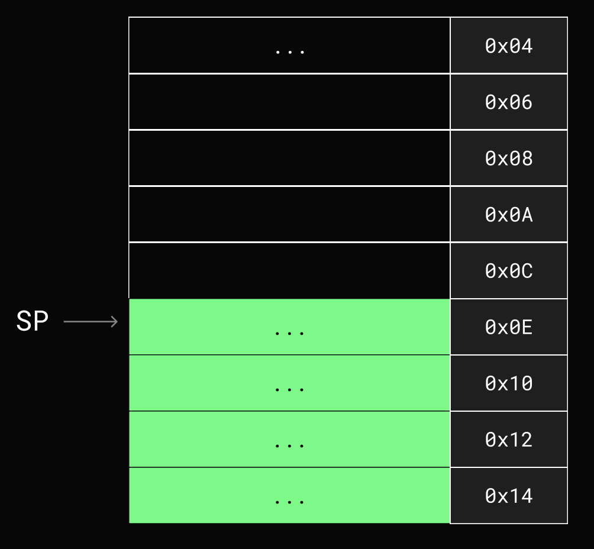

2. `BP (base pointer)` - это начало фрейма или адрес, с которого в стек вносятся или изменяются значения:

    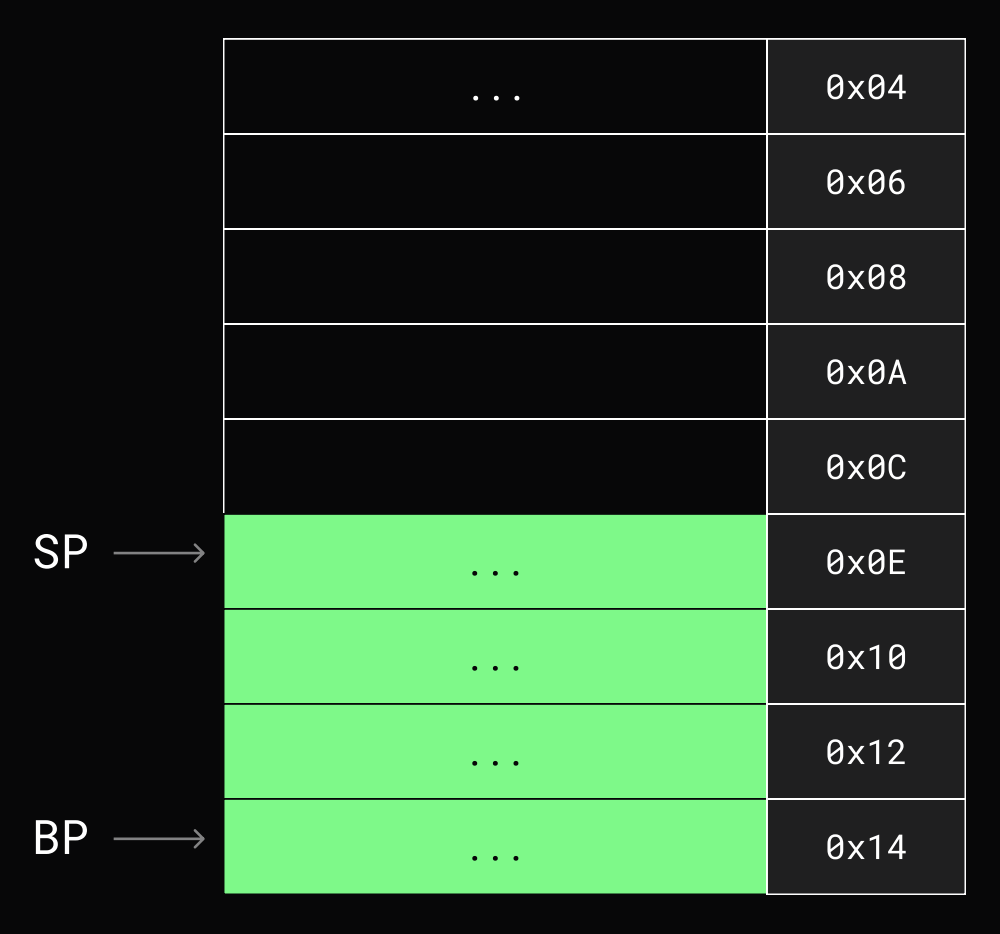

3. `IP (instruction pointer)` - это указатель на команду, которая будет выполняться следующей:

    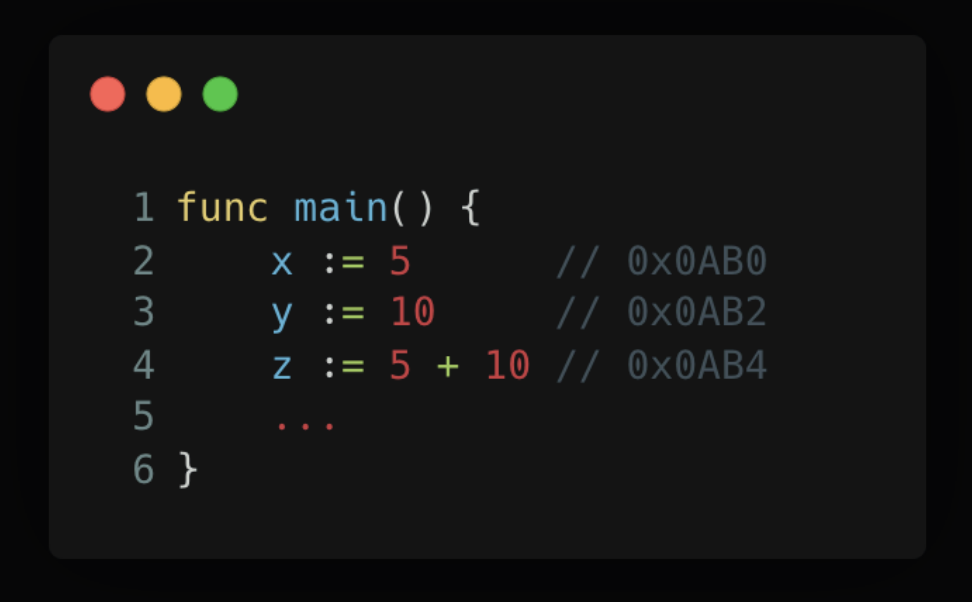

### Основные команды

1. `PUSH` - поместить данные на вершину стека

    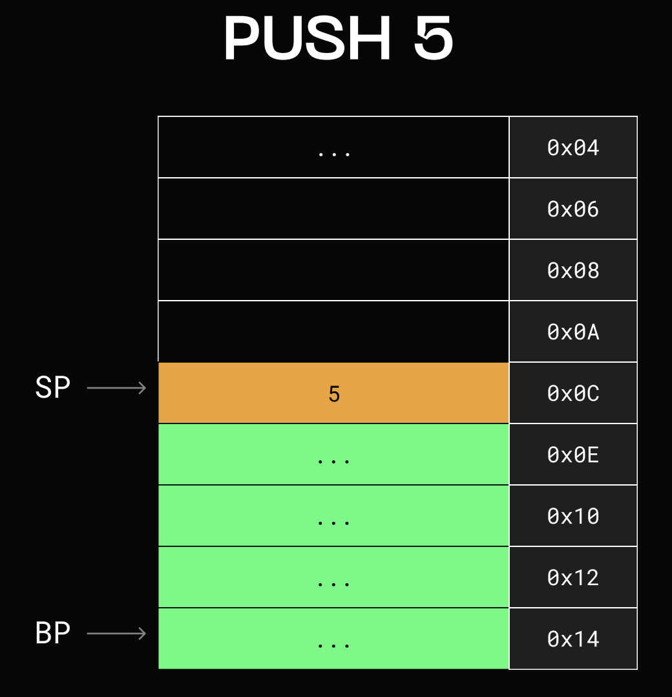

2. `POP` - снять и получить данные с вершины стека

    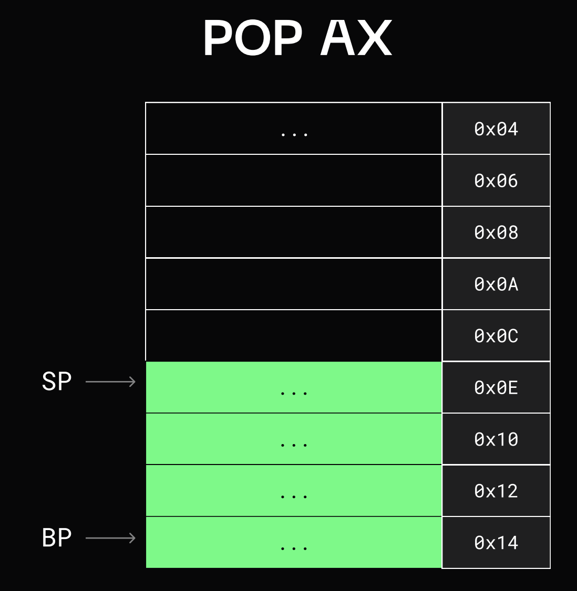

3. `JMP` - "прыгаем" из одного участка кода в другой по определенному адресу (меняя при этом IP):

    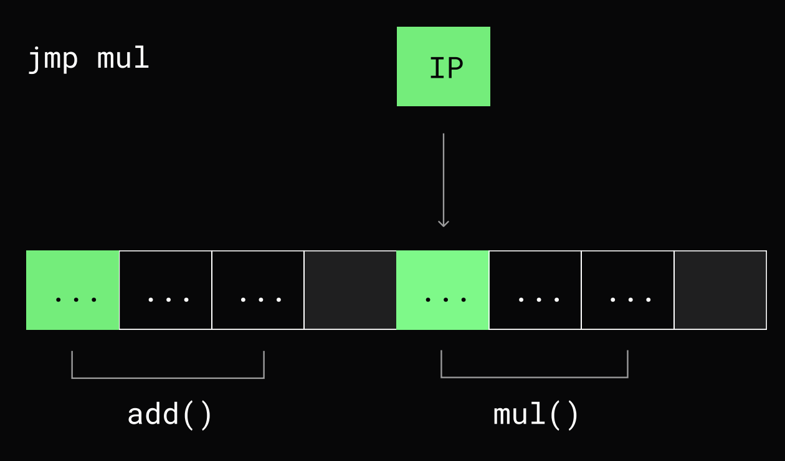

4. `CALL` - перед тем, как "прыгнуть" (`JMP`) по адресу - заносит в стек адрес возврата, после чего происходит `JMP`. Адрес возврата - это адрес инструкции следующей за `CALL`:

    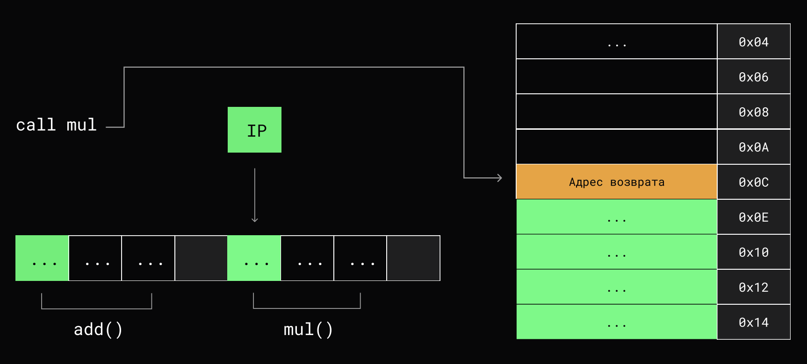

5. `RET` - получает из стека адрес возврата и переходит по нему:

    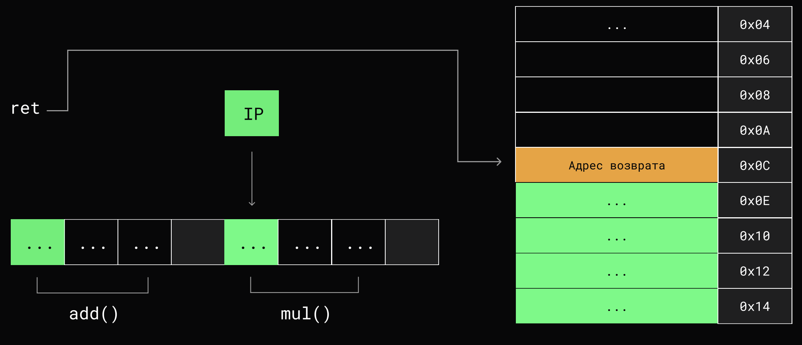

### Фрейм функции (тут и далее не осилил, добей как нибудь)

`Фрейм функции` - это локальное окружение функции в виде ее переменных:

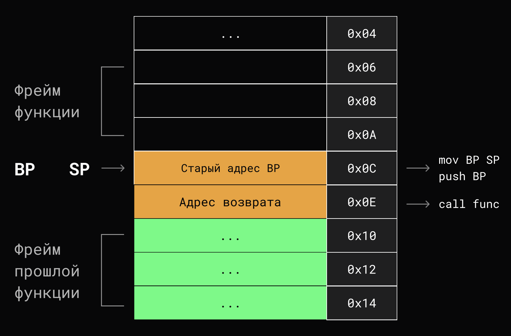

## Дополнительные материалы

1. [Функциональная парадигма в Go](https://habr.com/ru/companies/otus/articles/476346/)
2. [Паттерны функционального программирования](https://habr.com/ru/articles/337880/)
3. [Как использовать defer в Go](https://habr.com/ru/companies/otus/articles/833702/)
