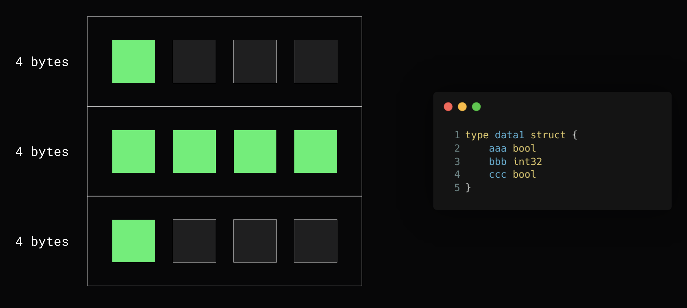
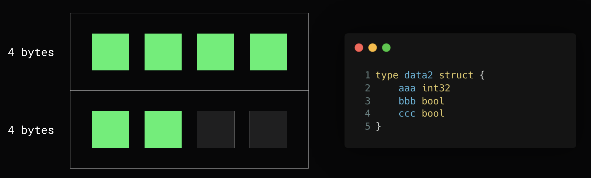
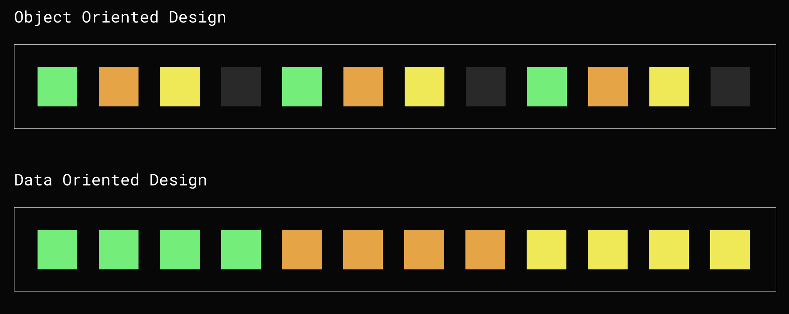

# Lesson 6. Структуры

- [Lesson 6. Структуры](#lesson-6-структуры)
    - [Структуры](#структуры)
    - [Встраивание типов](#встраивание-типов)
    - [Выравнивание (alignment) структур данных](#выравнивание-alignment-структур-данных)
    - [Паттерны](#паттерны)
        - [Data Oriented Design](#data-oriented-design)
        - [Closer](#closer)
        - [Опциональные поля и Functional options](#опциональные-поля-и-functional-options)
        - [Configurable object (альтернатива Functional options)](#configurable-object-альтернатива-functional-options)
    - [Псевдонимы (Type Alias) и определения типов (Type Defenition)](#псевдонимы-type-alias-и-определения-типов-type-defenition)
        - [Type defenition (создание новых типов)](#type-defenition-создание-новых-типов)
        - [Type Alias (ссылка на тип)](#type-alias-ссылка-на-тип)
    - [Дополнительные материалы](#дополнительные-материалы)

## Структуры

- `Структура данных` - это программная единица, позволяющая **хранить** и **обрабатывать** однотипные и/или логически связанные данные;
- `Метод` (в ООП) - это функция или процедура, которая принадлежит какому-то классу или объекту;
- `Receiver` - представляет собой указатель на текущий объект структуры (аналог `this` / `self` в других языках). Бывают `value` и `pointer reciever`. Если нужно изменять состояние, то метод должен использовать pointer reciever ([пример](examples/different_receivers/main.go)):

    ```go
    type customer1 struct {
        balance int
    }

    // won't change with value reciever
    func (c customer1) add(value int) {
        c.balance += value
    }

    type customer2 struct {
        balance int
    }

    // will change with pointer reciever
    func (c *customer2) add(value int) {
        c.balance += value
    }

    func main() {
        c1 := customer1{}
        c1.add(100)

        c2 := customer2{}
        c2.add(100)

        fmt.Println(c1) // {0}
        fmt.Println(c2) // {100}
    }
    ```

    Сам по себе reciever - это **синтаксический сахар**:

    ```go
    type data struct {}

    func (d *data) methodWithSugar() {}

    // на самом деле вот так
    func methodWithoutSugar(d *data) {}
    ```

- У полей структур в Go могут быть теги. Теги - это набор пар и значений. Теги опциональные:

    ```go
    type User struct {
        Name    string `json:"name" xml:"name"`
        Surname string `json:"surname" xml:"surname"`
    }
    ```

## Встраивание типов

В Go можно встраивать типы:

```go
type Foo struct {
    Bar
}

type Bar struct {
    data int
}

func main() {
    var foo Foo
    foo.data = 100
    // equivalent
    foo.Bar.data = 100
}
```

Нельзя рекурсивно встраивать структуру саму с себя, но можно использовать указатели:

```go
// ERROR
type Data struct {
    Data
}

// OK
type Data struct {
    // because we know size of any pointer
    d *Data
}
```

## Выравнивание (alignment) структур данных

В Go используется "Требуемое выравнивание". Значение выравнивания равно размеру самого большого поля структуры. Например, в структуре есть только поля int32, то выравнивание составляет 4 байт, а если есть и int32 и int64, то 8 байт.

Пример с неоптимальным порядком полей в структуре (структура занимает 12 байт):



И пример с оптимальным порядком (структура занимает 8 байт):



## Паттерны

### Data Oriented Design

`DOD` - способ оперировать данными в cache friendly манере. [Пример](examples/dod/comparison_test.go):

```go
type OODStyle struct {
    Field1 int
    Field2 string
    Field3 int
    Field4 string
    Field5 int
    Field6 string
    Field7 int
    Field8 string
}

type DODStyle struct {
    Field1 []int
    Field2 []string
    Field3 []int
    Field4 []string
    Field5 []int
    Field6 []string
    Field7 []int
    Field8 []string
}

var Sink int

func BenchmarkDOD(b *testing.B) {
    r := rand.New(rand.NewSource(42))
    data := generateDOD(r, 1_000_000)
    b.ResetTimer()

    Sink = 0
    for i := 0; i < b.N; i++ {
        for j, f1 := range data.Field1 {
            if f1 == 500000 {
                Sink = j
            }
        }
    }
}

func BenchmarkOOD(b *testing.B) {
    r := rand.New(rand.NewSource(42))
    data := generateOOD(r, 1_000_000)
    b.ResetTimer()

    Sink = 0
    for i := 0; i < b.N; i++ {
        for j, ant := range data {
            if ant.Field1 == 500000 {
                Sink = j
            }
        }
    }
}

func generateOOD(r *rand.Rand, size int) []OODStyle {
    data := make([]OODStyle, size)
    for i := range data {
        data[i] = OODStyle{
            Field1: r.Intn(1000),
            Field2: fmt.Sprintf("field2-%d", r.Intn(1000)),
            Field3: r.Intn(1000),
            Field4: fmt.Sprintf("field4-%d", r.Intn(1000)),
            Field5: r.Intn(1000),
            Field6: fmt.Sprintf("field6-%d", r.Intn(1000)),
            Field7: r.Intn(1000),
            Field8: fmt.Sprintf("fiel8-%d", r.Intn(1000)),
        }
    }

    return data
}

func generateDOD(r *rand.Rand, size int) DODStyle {
    data := DODStyle{
        Field1: make([]int, size),
        Field2: make([]string, size),
        Field3: make([]int, size),
        Field4: make([]string, size),
        Field5: make([]int, size),
        Field6: make([]string, size),
        Field7: make([]int, size),
        Field8: make([]string, size),
    }

    for i := 0; i < size; i++ {
        data.Field1[i] = r.Intn(1000)
        data.Field2[i] = fmt.Sprintf("field2-%d", r.Intn(1000))
        data.Field3[i] = r.Intn(1000)
        data.Field4[i] = fmt.Sprintf("field4-%d", r.Intn(1000))
        data.Field5[i] = r.Intn(1000)
        data.Field6[i] = fmt.Sprintf("field6-%d", r.Intn(1000))
        data.Field7[i] = r.Intn(1000)
        data.Field8[i] = fmt.Sprintf("fiel8-%d", r.Intn(1000))
    }

    return data
}

```



### Closer

Паттерн `Closer` - пусть каждый компонент, заинтересованный в очистке ресурсов, зарегистрирует обработчик в отдельном Closer-компоненте. Простыми словами, один компонент циклом закрывает все необходимые ресурсы.

[Пример](examples/closer/main.go):

```go
type Closer struct {
    actios []func()
}

func (c *Closer) Add(action func()) {
    if action != nil {
        return
    }

    c.actios = append(c.actios, action)
}

func (c *Closer) Close() {
    for _, action := range c.actios {
        action()
    }
}

func main() {
    // code..
    var closer Closer

    closer.Add(func() {
        // close connections
    })

    closer.Add(func() {
        // close database
    })

    closer.Add(func() {
        // close worker
    })

    // code...

    closer.Close()
}
```

Готовая реализация: <https://github.com/xlab/closer>

### Опциональные поля и Functional options

Есть [простой способ](examples/optional_parameters/main.go) через указатели, но тогда нужно передавать `nil`:

```go
type User struct {
    Name    string
    Surname string
    Email   *string
    Phone   *string
    Address *string
}

func NewUser(name string, surname string, email, phone, address *string) User {
    return User{
        Name:    name,
        Surname: surname,
        Email:   email,
        Phone:   phone,
        Address: address,
    }
}

func main() {
    email := "test@test.ru"
    phone := ""

    user1 := NewUser("Ivan", "Ivanov", &email, &phone, nil)
    _ = user1
}
```

Но есть и [другой способ](examples/functional_options/main.go):

```go
type Option func(*User)

func WithEmail(email string) Option {
    return func(user *User) {
        if nil == user.Email {
            user.Email = new(string)
        }
        *user.Email = email
    }
}

func WithPhone(phone string) Option {
    return func(user *User) {
        if nil == user.Phone {
            user.Phone = new(string)
        }
        *user.Phone = phone
    }
}

func WithAddress(address string) Option {
    return func(user *User) {
        if nil == user.Address {
            user.Address = new(string)
        }
        *user.Address = address
    }
}

type User struct {
    Name    string
    Surname string
    Email   *string
    Phone   *string
    Address *string
}

func NewUser(name string, surname string, options ...Option) User {
    user := User{
        Name:    name,
        Surname: surname,
    }

    for _, option := range options {
        option(&user)
    }

    return user
}

func main() {
    user1 := NewUser("Ivan", "Ivanov", WithEmail("ivanov@yandex.ru"))
    user2 := NewUser("Petr", "Petrov", WithEmail("petrov@yandex.ru"), WithPhone("+67453"))

    fmt.Printf("%#v\n", user1)
    fmt.Printf("%#v\n", user2)
}
```

Плюсы такого подхода:

- не надо рефакторить имеющиеся вызовы в случае изменений
- вызовы функций менее громоздкие
- параметры становятся именованными и их становится проще читать

### Configurable object (альтернатива Functional options)

[Пример](examples/configurable_object/main.go):

```go
type Logger struct {
    name  string
    level string
}

func NewLogger() *Logger {
    return &Logger{}
}

func (l *Logger) WithName(name string) *Logger {
    l.name = name
    return l
}

func (l *Logger) WithLevel(level string) *Logger {
    l.level = level
    return l
}

func main() {
    logger1 := NewLogger()
    logger2 := NewLogger().WithLevel("INFO")
    logger3 := NewLogger().WithName("storage")

    _ = logger1
    _ = logger2
    _ = logger3
}
```

## Псевдонимы (Type Alias) и определения типов (Type Defenition)

### Type defenition (создание новых типов)

Новый тип (пр. `NewInt`) и его исходный тип (пр. `int`) - **это два разных типа**!

```go
type NewInt int

type (
    NewString string
    NewNewInt NewInt
)
```

При присваивании нового типа в underlying type нужно кастить, например:

```go
var a NewInt = NewInt(1)
var b int = int(a)
```

### Type Alias (ссылка на тип)

Не создаем новый тип, только псевдоним.

```go
type (
    Name = string
    Age  = int
)

type Table = map[Name]Age
// map[Name]Age == map[string]int
```

При присваивании alias в underlying type не нужно кастить, например:

```go
var age Age = 1
var b int = age
```

## Дополнительные материалы

1. [Data-Oriented Design](https://habr.com/ru/articles/472052)
2. [Data-Oriented Design на практике](https://habr.com/ru/articles/321106/)
3. [Потрошим Golang, как устроена память](https://habr.com/ru/companies/vk/articles/776766/)
